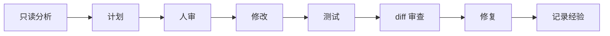
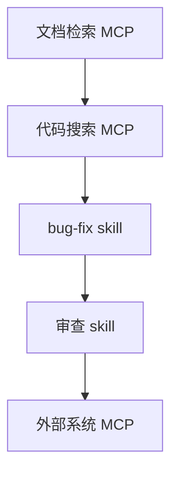

<div data-theme-toc="true"></div>

# 0.3 推荐学习路径

先跑通工作流，再补工具。工具会变，任务定义、上下文组织、验证和审查会长期保留。

每一阶段都要留下一个能检查的产物。没有产物，就很难判断你学会的是工作流，还是只看懂了概念。

## 第一阶段：网页对话会变成任务

目标：

- 会用 GPT / Claude / Gemini 澄清想法。
- 会把聊天结果整理成 PRD 或任务说明。
- 会判断什么时候网页对话已经不够。
- 记录自己缺的编程、Git、终端或项目运行基础。

网页对话的价值在于澄清，不在于直接接管仓库。这个阶段要练的是把想法压成任务卡。

练习：

```text
选一个小需求，让网页模型帮你写：
1. 目标
2. 不做什么
3. 验收标准
4. 风险
5. 需要本地 Agent 阅读的文件
```

阶段产物：一份可以交给本地 Agent 的任务卡。任务卡里必须有 `Goal`、`Out of Scope`、`Acceptance Criteria` 和需要阅读的本地文件。

## 第二阶段：掌握本地 Agent 基础闭环

目标：

- 会让 `Codex` / `Claude Code` / `OpenCode` 先读代码再写代码。
- 会要求它输出计划。
- 会让它运行测试。
- 会看 diff。

这一阶段只追求一件事：让 Agent 在本地仓库里完成一个小任务，并留下能检查的证据。

最小闭环：



阶段产物：一个小 diff、一组验证命令结果、一段你亲自审过的变更说明。

## 第三阶段：建立项目上下文

目标：

- 写出最小 `AGENTS.md` 或 `CLAUDE.md`。
- 把项目特有命令、规则、易错点写进去。
- 不把通用空话写进去。

上下文不是越多越好。它应该让 Agent 少猜，而不是把聊天窗口塞满。

练习：

```text
让 Agent 分析你的项目，然后生成：
1. 如何启动
2. 如何测试
3. 常见目录
4. 禁止模式
5. 完成标准
```

阶段产物：项目根目录里的 `AGENTS.md` 或 `CLAUDE.md`。文件长度先控制在一屏到两屏，先写命令、目录、禁止项和完成标准。

## 第四阶段：引入 MCP 和 skills

目标：

- 接一个只读 MCP，比如文档检索或代码搜索。
- 写一个自己的 skill，把高频流程固化。

先接只读工具，再考虑写权限。先写一个小 skill，再谈完整技能体系。

推荐顺序：



阶段产物：一个只读 MCP 配置和一个能稳定触发的小 skill。两者都要写明适用场景、权限和停止条件。

## 第五阶段：建立 Harness

目标：

- 长任务有 `prd.md` 和 `plan.md`。
- 多 Agent 有文件边界。
- 把运行验证命令作为默认完成步骤。
- 经验能沉淀到规范和 skills。

到这一步，你维护的是一套 AI 开发系统，不再只是一次次让 AI 写代码。

阶段产物：每个长任务都有任务目录、计划、验证记录和交接摘要。新会话能从文件继续，而不是回到聊天记录里翻上下文。

## 什么时候不要升级

如果当前任务只是一处小文案、一个简单脚本或一次只读咨询，不必立刻引入 MCP、skills 或 harness。升级的依据是重复成本、风险和恢复需求，不是工具数量。
