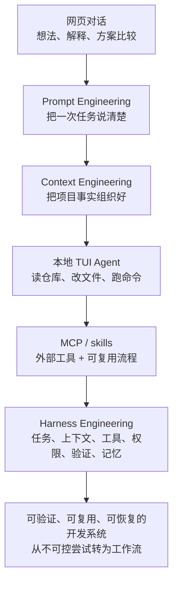

<div data-theme-toc="true"></div>

# 0.4 术语和心智模型地图

这本手册会反复使用一些词。它们描述的是同一条路径：怎么把 AI 从“聊天对象”变成“可控执行者”。

## 一张总图



这条路径不是要求你一次全部掌握。更实际的做法是：先能把任务交给本地 Agent，再逐步补上下文、工具、验证和恢复机制。

## Vibe Coding

本手册里的 Vibe Coding 指的是：开发者用自然语言、项目文档、工具接口和验证机制，指挥 AI 在真实代码仓库里完成软件开发任务。

它不是“不看代码”。你仍然要看 diff、看测试、看日志、看架构影响。变化在于，很多机械性的阅读、修改、补测试、整理文档，可以由 Agent 执行。

## Agentic 是什么意思

`Agentic` 可以粗略理解成“具备代理式行动能力”。在编程场景里，它通常包含四件事：

- 能读取上下文，而不是只看你刚输入的一段话。
- 能调用工具，例如读文件、运行命令、搜索代码、打开浏览器。
- 能在目标、观察、行动、验证之间循环。
- 能把一个较大的任务拆成多个较小步骤。

本手册不把 `Agentic` 当标题，是因为它对初学者不够直观。你只需要记住：当 AI 能自己读本地仓库、改文件、跑检查、根据结果继续调整时，它就已经不是普通网页聊天了。

## Prompt Engineering

Prompt Engineering 处理一次任务的表达质量。重点不在特殊措辞，而在目标、边界、上下文和验收标准是否写清。

一个可执行 prompt 至少要回答：

- 要改什么。
- 为什么要改。
- 相关文件或模块在哪里。
- 不要改什么。
- 完成后如何验证。

如果 prompt 里没有边界和完成标准，Agent 会把“看起来合理”当成完成。

## Context Engineering

Context Engineering 是把正确的信息放在正确的位置。

它包括：

- `AGENTS.md` / `CLAUDE.md`：让 Agent 进入仓库后知道先读什么、怎么工作。
- `docs/`：保存业务规则、架构约定、隐性契约。
- `specs/` / `tasks/`：描述本次变更要做什么、做到哪里停。
- 测试、日志、issue、PR 评论：作为事实来源，而不是聊天背景。

上下文不是越多越好。有用的上下文必须短、准、可定位、可维护。

## 本地 TUI Agent

本地 TUI Agent 指 [Claude Code](https://github.com/anthropics/claude-code)、[Codex](https://github.com/openai/codex)、[OpenCode](https://github.com/anomalyco/opencode) 这类在终端里运行、可以直接接触仓库的编码助手。

它们相对网页对话的关键差异是：

- 可以读取项目文件，不需要你复制粘贴。
- 可以修改多个文件，并展示 diff。
- 可以运行测试、lint、typecheck、构建。
- 可以按项目规则执行，而不是只依赖当前聊天。
- 可以和 Git、shell、MCP、skills 结合。

这也是为什么真实开发任务更适合放到本地 Agent，而不是网页聊天。

## MCP

[MCP](https://github.com/modelcontextprotocol) 是一种让 Agent 接入外部能力的协议。你可以把它理解成“为 Agent 提供外部工具接口”。

常见 MCP 能力包括：

- 读取项目外的数据源：Notion、Linear、Jira、GitHub、数据库。
- 运行专门工具：浏览器自动化、Figma、文档检索、日志查询。
- 暴露团队内部系统：工单、配置、监控、发布平台。

接入 MCP 后要重点看三件事：权限是否可控、数据是否可信、调用结果是否可验证。

## Skills

Skills 是可复用的流程说明。与 MCP 不同，Skills 解决的是遇到某类任务时该按什么流程做，而不是 Agent 能调用哪些工具。

适合做成 skill 的任务通常有三个特征：

- 经常重复。
- 步骤稳定。
- 有明确交付物或检查标准。

例如：修 bug、写 PR 描述、前端审美检查、安全审查、CI 失败定位、需求澄清、发布前检查。

一个 skill 至少要写清四件事：什么时候触发，按什么步骤做，输出什么，遇到什么情况停下。缺少停止条件的 skill 容易把小任务拖成大改动。

## Harness Engineering

Harness Engineering 是把 Agent 放进工程化运行系统。

一个可用 harness 至少包含：

- 任务入口：issue、PRD、spec、task 目录。
- 上下文入口：AGENTS/CLAUDE/GEMINI、docs、架构图。
- 执行边界：允许改哪些文件、哪些命令需要确认、哪些目录只读。
- 验证闭环：测试、lint、typecheck、构建、E2E、人工审查。
- 恢复机制：Git checkpoint、worktree、任务日志、交接摘要。
- 记忆沉淀：复盘、规则更新、skills、模板。

这一步追求的是稳定执行：AI 可以行动，但每一步都有边界、有验证、有恢复办法。

## 三个升级信号

如果你遇到下面情况，就应该升级工作流：

- 同一个 prompt 反复调，但每次结果不同：升级到 Context Engineering。
- Agent 能写代码，但总忘测试、忘风格、忘边界：升级到 AGENTS/CLAUDE 和 skills。
- 任务跨多天、多模块、多 Agent：升级到 Harness Engineering。

反过来，如果一次任务能用清楚 prompt、短上下文和一次验证解决，就先保持简单。过早堆工具会让你更难判断问题来自需求、上下文、工具权限，还是 Agent 自身输出。

## 最小记忆卡

```text
Prompt: 这次要做什么。
Context: 这次做对需要知道什么。
Agent: 谁来执行。
MCP: 需要什么外部工具。
Skill: 这类任务按什么流程做。
Harness: 如何让任务可控、可验证、可恢复。
Human: 最终判断和责任边界。
```
