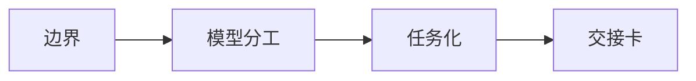

# 1. 从网页对话进入 Vibe Coding

很多人第一次接触 AI 编程，是从 ChatGPT、Claude、Gemini，或者 DeepSeek、Kimi、通义、豆包这类网页工具开始的。这个入口没问题，问题是一直停在复制粘贴里，用聊天框模拟真实开发。

这个模块讲清楚：网页对话什么时候有用，什么时候该切到本地 Agent。

这一章只处理“想清楚任务”。读仓库、改文件、跑验证，要交给后面的本地 Agent。

## 本章结构

| 子章节 | 目标 |
|---|---|
| [1-web-chat-boundary.md](1-web-chat-boundary.md) | 明确网页对话的能力边界 |
| [2-gpt-claude-gemini-roles.md](2-gpt-claude-gemini-roles.md) | 海外和国内 AI 工具怎么分工 |
| [3-turn-chat-into-task.md](3-turn-chat-into-task.md) | 把网页聊天结果整理成本地 Agent 可执行任务 |
| [4-web-to-local-handoff.md](4-web-to-local-handoff.md) | 把网页讨论压缩成交接卡 |

## 本章阅读方式

## 读完要学会什么

| 产物 | 用途 |
|---|---|
| 网页对话边界 | 知道哪些任务还留在网页，哪些任务要交给本地 Agent |
| 模型分工表 | 把澄清、比较、翻译、第二意见分给合适工具 |
| 任务说明 | 把聊天内容压成目标、边界、风险和验收标准 |
| 交接卡 | 让本地 Agent 接手时少猜项目背景 |

## 本章边界

网页对话负责把事情想清楚，本地 Agent 负责把事情做出来。

网页模型无法访问你的本地仓库，不要让它推断项目结构。让它帮你澄清目标、边界、风险和验收标准，然后把结果压缩成交接卡，交给能读仓库、改文件、跑验证的工具。

读完本章后进入 [2. Prompt / Context / Harness 三层工程方法](../2-engineering-layers/index.md)。如果你已经有任务卡，可以跳到 [3.7 第一次真实任务会话演练](../3-local-agents/7-first-session-walkthrough.md)。
