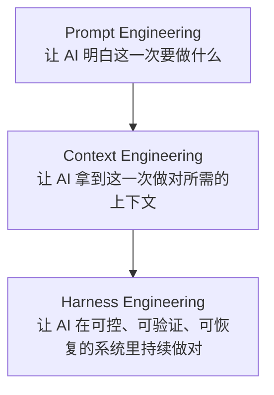

# 2. Prompt / Context / Harness 三层工程方法

很多人学 AI 编程，第一站是 `Prompt Engineering`。到了真实项目，只会写 prompt 很快不够：任务要说清，上下文要给准，执行过程要能验证，失败后还要能接上。

这一章把 AI 编程分成三层：

这一章只做概念和升级判断。搭 harness 时读 [6-harness-engineering](../6-harness-engineering/index.md)；找执行清单和提示词时读 [8-best-practices](../8-best-practices/index.md)；要把做法固化成项目模板，读 [9-development-system](../9-development-system/index.md)。

## 本章结构

| 子章节 | 目标 |
|---|---|
| [1-prompt-engineering.md](1-prompt-engineering.md) | 把 prompt 当成任务定义，而不是特殊措辞 |
| [2-context-engineering.md](2-context-engineering.md) | 组织项目上下文和规范文件 |
| [3-harness-engineering.md](3-harness-engineering.md) | 先理解 harness 为什么需要可控执行环境 |
| [4-upgrade-signals.md](4-upgrade-signals.md) | 判断什么时候该升级 |
| [5-context-doc-patterns.md](5-context-doc-patterns.md) | 设计上下文文档层级 |

## 读完要学会什么

| 产物 | 用途 |
|---|---|
| 四段式 prompt | 把一次任务说清楚 |
| 上下文清单 | 判断 Agent 做对需要哪些项目事实 |
| Harness 边界 | 知道什么时候要从“提示词”升级到“系统” |
| 升级信号表 | 任务失败时判断该补哪一层 |
| 文档层级草图 | 决定 README、AGENTS、docs、tasks 分别放什么 |

## 本章边界

前三节是递进关系：先写清任务，再组织上下文，最后构建系统。后两节负责升级判断和上下文文件分层。

如果一次任务失败，不要只改 prompt。先判断失败发生在哪一层：目标没说清是 prompt 问题，项目事实缺失是 context 问题，反复跑偏、无法验证或无法恢复，就是 harness 问题。

读完本章后进入 [3. 本地 Agent](../3-local-agents/index.md)。如果你已经能跑通本地 Agent，但缺项目规则，先读 [2.5 上下文文档的分层与维护模式](5-context-doc-patterns.md)。
