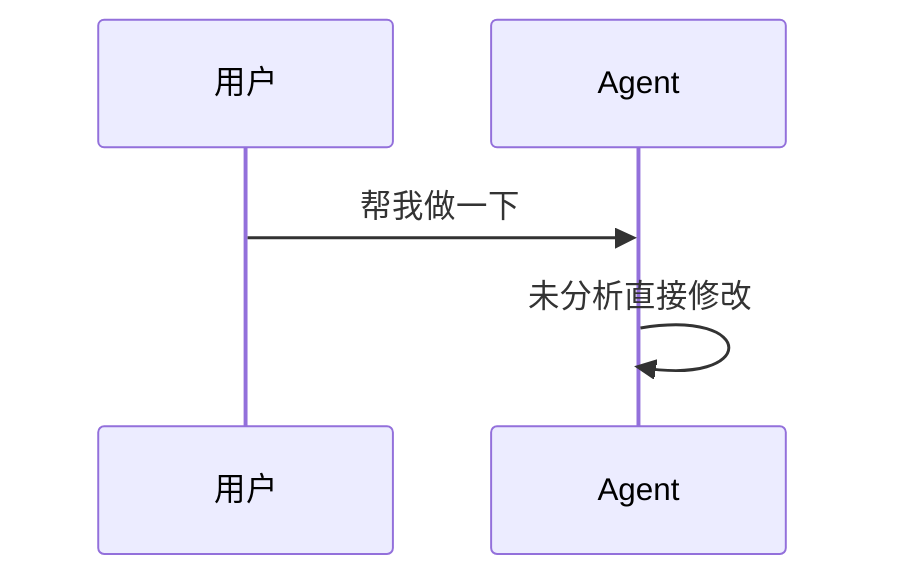
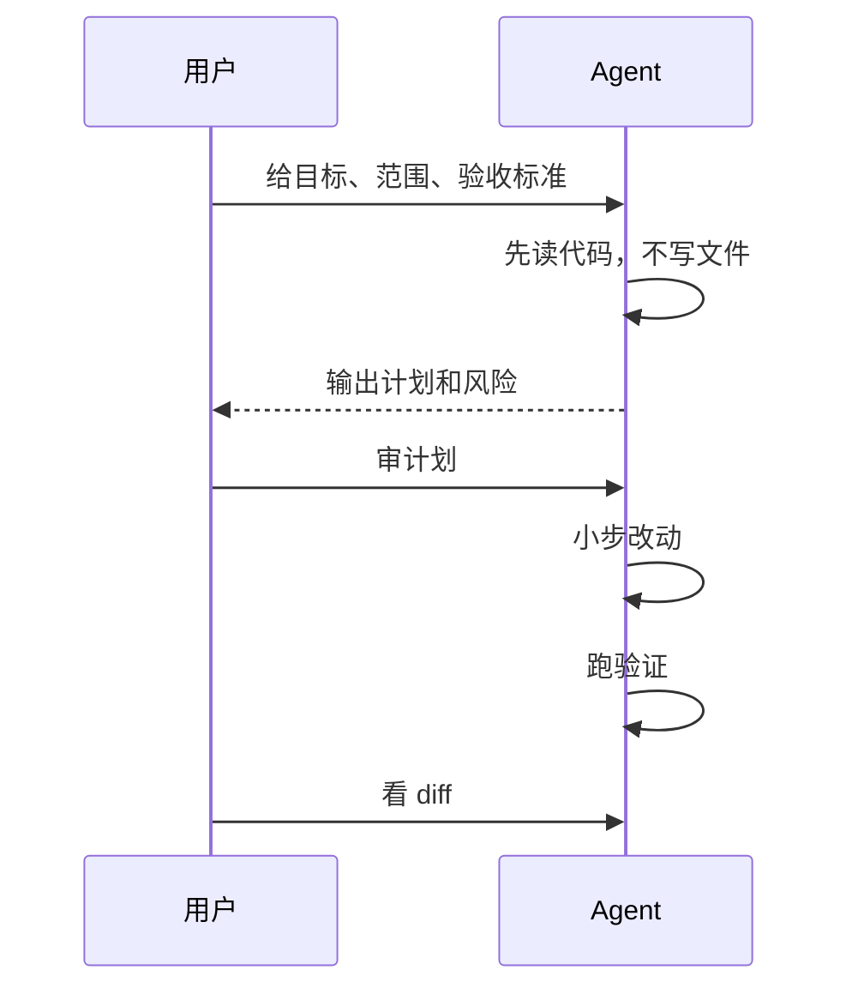

# 3.1 为什么需要本地 Agent

本地 Agent 的价值不只是回答问题。它可以进入真实工程环境：看文件、改文件、运行命令，并把错误改动暴露在测试和 diff 里。

## 它能做网页对话做不了的事

| 能力 | 意义 |
|---|---|
| 读文件 | 不需要你复制粘贴上下文 |
| 搜索代码 | 能找调用链、相似实现、测试位置 |
| 修改文件 | 直接生成可审查 diff |
| 运行命令 | 用测试、lint、构建验证结果 |
| 读取规范 | 自动加载 `AGENTS.md` / `CLAUDE.md` |
| 管理多轮修复 | 命令失败后能继续定位 |
| 接工具 | 通过 MCP、skills、hooks 扩展能力 |

## 本手册里的主力 CLI

本手册默认把三类工具作为本地 Agent 主体。先不用比较谁更强，它们适合的工作方式不同：

| 工具 | 主要定位 |
|---|---|
| `Claude Code` | 复杂任务协作，适合 skills、hooks、subagents、MCP 组合 |
| `Codex` | 工程执行和验证闭环，适合明确委派、测试、审查和 OpenAI 工具链 |
| `OpenCode` | 开放多模型 TUI，适合 provider 切换、本地模型、LSP 和自定义 agent |

`Gemini CLI` 只作为辅助位：适合大上下文资料整理、低成本探索和第二意见。它有用，但不是本手册训练本地开发闭环的主线。

## 本地 Agent 的工作方式

一个正常任务不应该这样开始：

更稳的方式是：

这就是结构化使用和随手使用的区别：前者留下计划、验证和 diff，后者容易产生不可预期的改动。

## 本地 Agent 的风险

本地 Agent 有真实文件和命令能力，因此也有真实风险：

- 改错文件。
- 删除重要内容。
- 跑高风险命令。
- 引入依赖。
- 修改配置。
- 测试没过却说完成。

所以本地 Agent 必须配合一套控制机制：

- 明确任务边界。
- 最小权限。
- Git diff 审查。
- 验证命令。
- 规范文件。

## 最小启动策略

第一次用本地 Agent，不要做大任务。先让它在小范围里证明自己能读懂、能改对、能验证，再把任务放大。

选择一个：

- 小 bug。
- 单文件样式调整。
- 补一个测试。
- 写一个脚本。
- 整理 README。

用它练习完整闭环，不要在初始阶段追求大范围任务。
