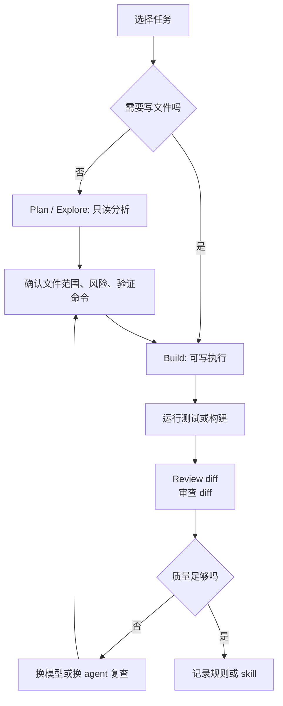

<div data-theme-toc="true"></div>

# 3.4 OpenCode 的操作模型

`OpenCode` 更适合理解为一个开放、可配置、模型无关的本地 TUI Agent 外壳。它的价值不在于默认模型排名，而在于把工具层和模型层拆开，让你能按任务选择不同模型、供应商和权限策略。

如果 `Claude Code` 的优势是集成路径清楚，`Codex` 的优势是明确委派和 OpenAI 工具链，`OpenCode` 的优势就是控制权。

## OpenCode 解决什么问题

| 问题 | OpenCode 的价值 |
|---|---|
| 不想被单一模型供应商锁住 | 可以接不同供应商，也可以接本地模型 |
| 想把 TUI Agent 做成自己的工作台 | 配置、agent、权限、模型路由更容易按个人或团队习惯调整 |
| 希望计划和执行分离 | 可以用只读规划 Agent 做分析，再切到可写实现 Agent |
| 希望代码智能接近 IDE 能力 | LSP 能提供类型、诊断、符号等上下文辅助 |

初学者不用急着配置这些能力。先记住一点：当你开始在多个模型、多个任务类型、多个权限级别之间切换时，OpenCode 更容易变成统一入口。

## CLI 与配置入口

OpenCode 的日常入口分两类：命令行用于查看、添加、授权和调试，`opencode.json` 用于保存 provider、agent、MCP、权限和 LSP 配置。先把稳定规则写进配置文件，再让 Agent 在任务里读取，效果通常比反复口头说明更稳。

| 目标 | 入口 | 用法 |
|---|---|---|
| 添加 MCP | `opencode mcp add` | 交互式添加本地或远程 MCP |
| 查看 MCP | `opencode mcp list` / `opencode mcp ls` | 检查已配置 server 和连接状态 |
| 授权 MCP | `opencode mcp auth <name>` | 给需要 OAuth 的远程 MCP 授权 |
| 清除授权 | `opencode mcp logout <name>` | 移除某个 MCP 的本地凭据 |
| 调试 MCP | `opencode mcp debug <name>` | 检查连接和 OAuth 问题 |
| 创建 agent | `opencode agent create` | 生成带模式、模型和权限的 agent |
| 查看 agent | `opencode agent list` | 检查已配置 agent |
| 查看模型 | `opencode models` / `opencode models <provider>` | 确认可用模型名 |
| 全局配置 | `~/.config/opencode/opencode.json` | 个人 provider、agent、MCP、权限配置 |
| 项目配置 | `opencode.json` | 当前仓库共享配置 |
| 个人 skill | `~/.config/opencode/skills/<name>/SKILL.md` | 个人复用流程 |
| 项目 skill | `.opencode/skills/<name>/SKILL.md` | 仓库内复用流程 |

MCP 的完整练习放在 [5.1 MCP 入门](../5-mcp-skills/1-mcp-basics.md)，skills 的写法放在 [5.2 skills：把流程做成卡片](../5-mcp-skills/2-skills-basics.md)。OpenCode 章节只保留入口，避免和第 5 章重复。

## 典型工作流



不要把 OpenCode 当成“另一个聊天窗口”。它更像一个可以切换工作模式的终端工作台：

- 只读模式用于理解本地仓库、找文件、做计划。
- 可写模式用于实现、修复、补测试。
- 子 agent 用于并行探索或专项审查。
- 不同模型用于不同质量、速度、成本和隐私约束。

## 模型选择策略

OpenCode 的能力上限取决于你接入的模型。实战里不要只比较模型强弱，先看当前阶段到底需要什么：

| 阶段 | 推荐模型策略 | 原因 |
|---|---|---|
| 仓库初读 | 便宜、快、长上下文模型 | 读取多、改动少，成本更重要 |
| 复杂实现 | 强代码模型 | 需要跨文件一致性和指令遵循 |
| 代码审查 | 换一个强模型复查 | 避免同一模型自证正确 |
| 低风险脚本 | 本地或低成本模型 | 失败成本低，适合省预算 |
| 隐私敏感探索 | 本地模型或内部模型 | 避免把敏感代码送外部 API |

不要让弱模型承担复杂重构。OpenCode 给你的是选择权，不是让任何模型都突然变强。

## OpenCode 适合的任务

适合：

- 你想在同一个 TUI 里使用 OpenAI、Anthropic、Gemini、OpenRouter、本地模型等不同后端。
- 你重视开源、可审计、可改造的工具链。
- 你希望用 LSP 辅助代码理解。
- 你想把规划、实现、审查拆成不同 Agent。
- 你希望比较多个模型对同一任务的输出。
- 你有本地模型、公司内部模型或自建网关。

不适合：

- 你只想不配置就跑复杂任务。
- 你不想管理 API key、模型成本和 provider 差异。
- 你所在团队需要明确商业支持和统一供应商责任。
- 你没有强模型可用，却期待它稳定完成复杂多文件开发。

## 和 Codex / Claude Code 的关系

OpenCode 不一定替代 `Codex` 或 `Claude Code`。更实际的做法是按场景组合：

| 场景 | 更合适 |
|---|---|
| 想快速进入 Claude Code 的官方工作流，重点用 skills、hooks、subagents | Claude Code |
| 想用 OpenAI 模型做明确委派、测试修复、审查 | Codex |
| 想统一多个模型供应商、接本地模型、配置 agent / skills / LSP | OpenCode |
| 想免费或长上下文辅助阅读 | Gemini CLI 辅助 |

如果你刚开始学习本地 Agent，优先让 `Claude Code` 或 `Codex` 的闭环稳定运行。等你明确需要“换模型”“接本地模型”“让不同 agent 用不同模型”，再把 OpenCode 加进主力工作流。

## 最小上手方式

第一周不要追求复杂配置，先练三件事：

1. 用只读 Agent 让它分析一个本地仓库，输出文件地图、风险和验证命令。
2. 用可写 agent 做一个小 bugfix，要求最小 diff 和测试。
3. 用另一个模型或审查 Agent 审当前 diff，检查无关改动、测试缺口和边界风险。

最小提示词：

```text
先使用只读方式分析当前本地仓库，不要修改文件。

任务：
<一句话目标>

请输出：
1. 相关文件和调用链。
2. 现有实现模式。
3. 推荐使用哪个 agent 或模型阶段。
4. 修改计划。
5. 验证命令。
6. 风险和不做什么。
```

## 使用提醒

- OpenCode 的强项是可配置，不是免配置。
- 模型越多，越需要明确任务边界，否则只会增加混乱。
- 本地模型适合低风险和隐私场景，但复杂任务仍要看模型能力。
- 多 agent 并行前先拆文件范围，避免互相覆盖。
- 把稳定流程写进项目规则或自定义 agent，不要每次口头重复。
