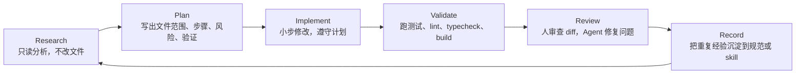

<div data-theme-toc="true"></div>

# 3.5 Claude Code / Codex / OpenCode 共通 Agent Loop

无论你用 `Claude Code`、`Codex` 还是 `OpenCode`，稳定的工作流都需要同一条循环。工具差异主要在权限、模型、配置和扩展点，基本工程闭环不会因为换了 CLI 就自动消失。

## 标准循环



## 每一步的交付物

本节保留 Research、Plan、Implement、Validate、Review、Record 这些英文阶段名，是为了对应常见 Agent 工作流。第一次阅读时，可以把它们理解为：只读分析、计划、实现、验证、审查、记录。

| 阶段 | 交付物 |
|---|---|
| Research（只读分析） | 相关文件、调用链、现有模式、风险 |
| Plan（计划） | 分步计划、文件范围、验证命令 |
| Implement（实现） | 最小改动 diff |
| Validate（验证） | 命令输出、失败原因、修复结果 |
| Review（审查） | 风险清单、未覆盖边界 |
| Record（记录） | AGENTS.md / CLAUDE.md / agent config / skill 更新建议 |

## 三个 CLI 的 loop 差异

| 阶段 | Claude Code | Codex | OpenCode |
|---|---|---|---|
| Research | 适合配合 subagents 和 MCP 做复杂探索 | 适合按上下文指针读本地仓库并形成任务计划 | 适合用只读 Agent、LSP 和不同模型探索 |
| Plan | 适合用 Plan / Thinking 流程拆任务 | 适合用 Goal / Context / Constraints / Done When 委派 | 适合把规划 Agent 和实现 Agent 分开 |
| Implement | 适合多文件功能和工具协作 | 适合最小补丁、测试修复和审查驱动修改 | 适合按模型能力切换执行方式 |
| Validate | 适合结合 hooks、MCP、浏览器工具 | 适合把验证作为 Done When 的硬要求 | 适合把验证命令写入 Agent 工作流 |
| Record | 适合沉淀到 `CLAUDE.md` 或 skill | 适合沉淀到 `AGENTS.md` 或 workflow | 适合沉淀到 agent 配置、提示文件或项目规则 |

## 什么时候必须先 Research

- 不熟悉代码库。
- 需要改多个文件。
- 需要接已有接口。
- 任务涉及安全、权限、支付、数据。
- 你不确定项目已有模式。

## 什么时候必须先 Plan

- 任务超过 20 行改动。
- 涉及 3 个以上文件。
- 有多个可选方案。
- 可能破坏兼容性。
- 需要人确认产品行为。

## 什么时候必须 Validate

所有真实项目任务都需要 Validate。哪怕只改一行，也要有某种验证方式。

如果无法运行验证，Agent 必须交代清楚：

- 为什么无法运行。
- 应该运行什么命令。
- 预期成功输出是什么。
- 如果失败下一步怎么查。

## 常用阶段提示词

Research：

```text
先不要修改文件。请阅读相关代码、调用链、已有测试和项目规范，然后总结现状。
```

Plan：

```text
请给出实现计划，列出要改的文件、每步目的、风险和验证命令。等我确认后再修改。
```

Implement：

```text
按刚才确认的计划实现。保持最小改动，不要重构无关代码。
```

Validate：

```text
请运行相关测试、lint、typecheck 或 build。失败时先分析原因，再做最小修复。
```

Review（审查）：

```text
请基于当前 diff 做自查，重点看无关改动、测试缺失、边界情况和安全风险。
```
