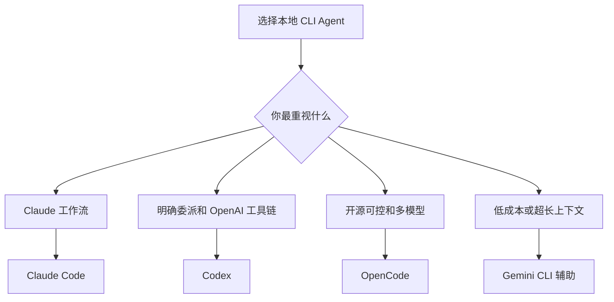
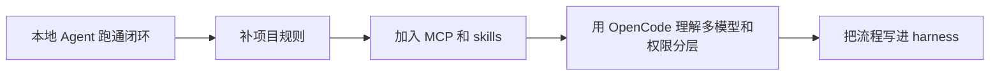

<div data-theme-toc="true"></div>

# 3.9 CLI Agent 对比与选型

本节只把 `Claude Code`、`Codex`、`OpenCode` 当主体讨论。`Gemini CLI` 在本手册里是辅助工具：适合低成本、长上下文、资料消化和第二意见，不作为主要本地开发 Agent 来训练。

## 一句话定位

| 工具 | 更像什么 | 主要价值 |
|---|---|---|
| [Claude Code](https://github.com/anthropics/claude-code) | 一体化开发 Agent | 复杂代码库理解、skills / hooks / subagents / [MCP](https://github.com/modelcontextprotocol) 工作流 |
| [Codex](https://github.com/openai/codex) | 工程执行 Agent | 明确委派、沙盒与权限、测试修复、代码审查、OpenAI 工具链 |
| [OpenCode](https://github.com/anomalyco/opencode) | 可定制的多模型 TUI 工作台 | 开源、多供应商、本地模型、LSP、agent 配置 |
| [Gemini CLI](https://github.com/google-gemini/gemini-cli) | 辅助阅读和预算工具 | 低成本、长上下文、多模态或资料整理 |

不要按“谁最好”排序。先看约束，再选工具：



## 维度 1：开发体验

`Claude Code` 更适合想快速进入官方工作流的人。它围绕 `CLAUDE.md`、skills、hooks、MCP、subagents 组织日常开发。你不需要先设计一套工具系统，就能开始做计划、实现、审查和工作流自动化。

`Codex` 更适合把任务当工程委派来处理。关键做法是把目标、上下文、约束、完成标准交给 Agent，然后让它读文件、改代码、跑命令、解释验证结果。对 bugfix、测试补齐、代码审查和多文件一致性审查任务，Codex 的使用心智更接近“给工程同事派一个可验收的任务”。

`OpenCode` 更适合愿意掌控工具链的人。它把 TUI、provider、模型、agent、权限和 LSP 能力组合在一起。它不是配置成本最低的默认选项，但在你需要多个模型、不同权限模式、本地模型或自定义 agent 时，长期可塑性更高。

`Gemini CLI` 不建议作为主线训练对象。它可以做大材料阅读、低成本探索、长上下文摘要和第二意见，但复杂多文件开发仍建议交给前三者中的主力工具。

## 维度 2：模型与工具链绑定

| 需求 | 更合适 |
|---|---|
| 团队已经主要使用 Claude，想用官方工具链 | Claude Code |
| 团队已经主要使用 OpenAI / ChatGPT / Codex | Codex |
| 想在 Claude、OpenAI、Gemini、本地模型之间切换 | OpenCode |
| 想先免费试大量上下文任务 | Gemini CLI |

模型锁定不是绝对坏事。一体化工具往往配置成本更低，开放工具往往更可控。初学者先用低配置成本的工具跑通闭环，进阶后再追求可控；否则很容易把时间花在换后端上，任务却没有推进。

## 维度 3：任务类型

| 任务 | 首选 | 原因 |
|---|---|---|
| 复杂仓库理解 | Claude Code / OpenCode | Claude Code 适合长任务协作，OpenCode 可用 explore / LSP 辅助 |
| 有边界的 bugfix | Codex / Claude Code | 需要读日志、跑测试、最小修复 |
| 测试补齐 | Codex | 适合明确完成条件和验证闭环 |
| 前后端多文件功能 | Claude Code / Codex | 需要计划、执行、验证和审查 |
| 多模型对照 | OpenCode | 可以让不同模型分别负责计划、实现和审查 |
| 私有代码低风险探索 | OpenCode + 本地模型 | 更容易控制数据边界 |
| 大资料摘要 | Gemini CLI / 网页 Gemini | 长上下文和成本更有优势 |
| skills 训练 | Claude Code / OpenCode | 两者都能读取 `SKILL.md`，目录和权限配置不同 |
| hooks / subagents 训练 | Claude Code | 官方工作流覆盖这些扩展点 |

## 维度 4：权限与安全

初学者最容易忽略权限问题。判断一个 CLI Agent 是否适合当前任务，不要只看能不能写代码，还要看它如何限制风险。能写文件是能力，也是责任。

| 风险 | 建议 |
|---|---|
| 会写文件 | 先用只读模式或要求先计划 |
| 会跑 shell | 默认让高风险命令人工确认 |
| 会接外部 MCP | 先只读，后写入 |
| 会多 agent 并行 | 用 worktree 或明确文件范围 |
| 会自动修复失败 | 要求先解释失败日志，再做最小补丁 |

工具差异：

- Claude Code：适合用 hooks、skills、subagents 和 MCP 做团队工作流，但高权限 hooks 和外部写入必须谨慎。
- Codex：适合用审批、沙盒、AGENTS.md 和验证命令控制工程执行。
- OpenCode：适合通过 agent 权限、模型选择、本地模型和 LSP 组合控制任务形态。
- Gemini CLI：适合低风险阅读和辅助判断，不建议让它独立承担高风险生产修改。

## 推荐学习顺序

如果你面向“最终独立 vibe coding 开发”，建议顺序是：



第一阶段只选一个主力工具，不要同时学四个 CLI。你要练的是 Agent Loop，不是扩展工具清单。

## 最小组合建议

个人开发者：

```text
主力：Claude Code / Codex / OpenCode 任选一个
辅助：Gemini CLI
规则：AGENTS.md / CLAUDE.md / opencode.json
验证：test / lint / typecheck / build
```

进阶个人或小团队：

```text
主力执行：Claude Code / Codex
多模型工作台：OpenCode
资料辅助：Gemini CLI
扩展：MCP + skills
治理：task directory + plan.md + validation.md + 审查
```

企业或严肃项目：

```text
统一入口：明确主力 Agent
权限控制：审批、sandbox、hook、MCP 权限分级
上下文：AGENTS.md / CLAUDE.md / opencode.json / specs
验证：CI + e2e + 代码审查
恢复：worktree + task state + rollback policy
```

## 本手册的默认建议

默认主线：

```text
Claude Code / Codex 练基本功。
OpenCode 练多模型、开放工具链和本地模型思维。
Gemini CLI 做辅助阅读、资料压缩、长上下文第二意见。
```

如果你只能选一个主力：

- 想要 Claude 官方工作流：选 `Claude Code`。
- 想要明确委派和 OpenAI 工具链：选 `Codex`。
- 想要开放、多模型、本地模型和可改造：选 `OpenCode`。

选完以后至少连续用两周。频繁换工具会掩盖问题：任务定义、上下文、验证和审查没有做好。
