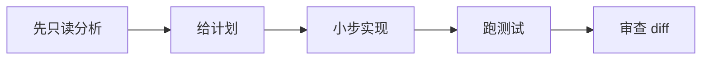

<div data-theme-toc="true"></div>

# 4.4 按真实场景选择工具

> 阅读完本节后，你应该能根据任务类型选择 GPT / Claude / Gemini / Claude Code / Codex / OpenCode / Cursor / Trae / Windsurf / MCP / skills / harness，而不是仅凭偏好切换工具。

Coding 工具选型的核心是判断哪个工具适合当前任务的上下文形态。模糊需求、真实本地仓库、浏览器复现、团队流程，对工具的要求完全不同。

## 场景 1：想法还很模糊

推荐：

```text
网页 GPT / Claude / Gemini
```

适合做：

- 澄清目标。
- 拆用户故事。
- 列风险。
- 生成 PRD 初稿。
- 比较方案。

不要做：

- 让网页模型猜本地仓库结构。
- 让网页模型给出大段不可验证代码。

结束条件：

```text
产出 Task Handoff 或 PRD，而不是产出最终代码。
```

## 场景 2：已有本地仓库，要做一个小功能

推荐：

```text
Claude Code / Codex / OpenCode
```

原因：

- 能读文件。
- 能看已有模式。
- 能修改代码。
- 能跑验证。
- 能看 diff。

操作方式：



## 场景 3：你正在 IDE 里改一小段代码

推荐：

```text
Cursor / Trae / Windsurf / IDE Copilot
```

适合：

- 补全函数。
- 局部解释。
- 小范围重命名。
- 当前文件内修补。
- UI 细节调整。

不适合：

- 多目录重构。
- 长任务治理。
- 需要独立跑完整验证的工作。

## 场景 4：复杂 bug，必须复现

推荐组合：

```text
Claude Code / Codex
+ 测试命令
+ 浏览器 MCP 或 Playwright
+ 完整日志
```

流程：


不要一开始就让 Agent 猜根因。先复现，再定位，不然它很容易把症状当原因。

## 场景 5：前端视觉和交互探索

推荐组合：

```text
网页模型做风格探索
本地 Agent 实现代码
浏览器工具做截图验证
```

如果只是局部组件，可用 Cursor / Trae / Windsurf。
如果涉及路由、状态、数据流、构建验证，切到 `Claude Code` / `Codex` / `OpenCode`。

## 场景 6：需要多模型或本地模型

推荐：

```text
OpenCode
```

适合：

- 用一个 TUI 接多个供应商。
- 用本地模型做低风险探索。
- 让不同模型分别负责计划、实现和审查。
- 团队想降低单一供应商锁定。

不要做：

- 用弱本地模型硬接复杂架构重构。
- 同时开多个 agent 改同一批文件。
- 忽略模型成本、上下文大小和隐私边界。

## 场景 7：需要最新框架或 API 文档

推荐：

```text
文档 MCP / 官方文档
```

然后再让本地 Agent 改代码。不要依赖模型记忆判断最新 API。模型可能知道过期版本，也可能把不同版本写法混在一起；表述可能很确定，但实际运行会失败。

## 场景 8：重复流程已经出现三次

推荐：

```text
skill
```

适合固化：

- PR 审查流程。
- 发布检查。
- bug root cause 分析。
- 文档同步。
- issue triage。
- 测试生成规范。

判断标准：

```text
如果你第三次复制同一段长提示词，就该考虑写 skill。
```

## 场景 9：需要连接外部系统

推荐：

```text
MCP
```

适合查 GitHub issue / PR、Jira / Linear、数据库 schema、浏览器、内部文档和监控日志。

权限原则：

```text
能只读就只读。
能低权限就低权限。
能限制输出就限制输出。
高风险写入必须人工确认。
```

## 场景 10：任务跨度超过一天

推荐：

```text
Harness Engineering
```

需要 PRD、任务拆分、会话记录、验证清单、文档同步规则和恢复机制。

这时不要只靠“一个很长的 prompt”。长任务需要系统，不是更长的聊天。继续增加聊天内容会降低有效上下文比例。

## 场景矩阵

| 任务 | 首选 | 辅助 |
|---|---|---|
| 需求澄清 | 网页 Claude / GPT | Gemini 做长上下文整理 |
| 小功能实现 | Claude Code / Codex / OpenCode | AGENTS.md / CLAUDE.md / agent config |
| 当前文件局部修改 | Cursor / Trae / Windsurf | 本地 Agent 审查 |
| 多文件重构 | Claude Code / Codex | 测试 + worktree |
| UI 方案探索 | 网页模型 | 本地 Agent + 浏览器验证 |
| 查最新 API | 文档 MCP | 官方文档 |
| 复现浏览器 bug | Playwright / Browser MCP | 本地 Agent |
| 多模型对照 | OpenCode | 强模型 + 低成本模型组合 |
| 重复工作流 | skill | MCP 提供数据 |
| 长任务 | [Trellis](https://github.com/mindfold-ai/trellis) / [OpenSpec](https://github.com/Fission-AI/OpenSpec) / [GSD](https://github.com/gsd-build/get-shit-done) | [Superpowers](https://github.com/obra/superpowers) / 多 Agent |
| 高风险变更 | 本地 Agent + harness | 人工审查 |

## 快速决策规则

```text
想清楚：网页模型。
做出来：Claude Code / Codex / OpenCode。
改局部：编辑器 Agent。
接外部：MCP。
固化流程：skill。
管长任务：harness。
```
