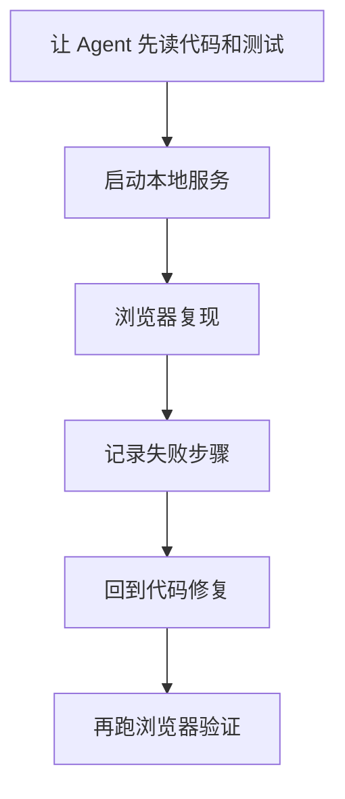

<div data-theme-toc="true"></div>

# 5.6 MCP 类型目录与风险分级

> 这一节用于判断一个 MCP 是否应该接入、应该给什么权限、适合搭配什么 skill。

[MCP](https://github.com/modelcontextprotocol) 的难点不在于“能不能接更多工具”，而在于“接入后是否真的降低上下文搬运成本，并且风险可控”。

## MCP 类型目录

| 类型 | 解决的问题 | 典型用途 |
|---|---|---|
| 文档检索 | 模型知识可能过期 | 查框架、SDK、API 当前文档 |
| 代码搜索 | 本地仓库太大 | 语义检索、调用链定位 |
| 浏览器自动化 | UI bug 难复现 | 页面操作、截图、表单流 |
| Git 平台 | PR / issue 在远端 | 用 [GitHub MCP Server](https://github.com/github/github-mcp-server) 读 PR、读审查意见、发评论 |
| 项目管理 | 需求在 Jira / Linear | 用 [Atlassian MCP Server](https://github.com/atlassian/atlassian-mcp-server) 或 [Notion MCP Server](https://github.com/makenotion/notion-mcp-server) 拉 ticket、同步状态、写进展 |
| 数据库 | schema 和数据在库里 | 查 schema、只读排错 |
| 监控日志 | 线上问题缺事实 | 查 [Sentry](https://github.com/getsentry/sentry)、[Datadog Agent](https://github.com/DataDog/datadog-agent)、日志 |
| 设计资产 | UI 信息在 Figma | 读取设计稿、tokens、文案 |
| 内部系统 | 公司知识不可公开 | 查内部文档、服务目录、runbook |

## 风险分级

| 等级 | MCP 能力 | 默认策略 |
|---|---|---|
| L0 | 只读公共信息 | 可直接使用 |
| L1 | 只读项目内部信息 | 限定范围，限制输出 |
| L2 | 读敏感信息 | 最小权限，避免写入上下文日志 |
| L3 | 写文件、写工单、发评论 | 每次写入前确认 |
| L4 | 改数据库、部署、改权限 | 默认不要给 Agent 自动执行 |

一个 MCP 的风险不取决于名字，取决于它能做什么。

## 文档 MCP

适合：

- 新框架。
- SDK 版本频繁变化。
- API 调用容易写错。
- 官方文档比博客可靠。

使用方式：

```text
请先通过文档 MCP 查询当前版本推荐写法，再基于本项目代码给出实现计划。
```

不要把文档 MCP 当通用搜索入口。每次查询要带版本、框架、目标。

## 浏览器 MCP

适合：

- 复现用户点击路径。
- 检查表单验证。
- 对比截图。
- 测试登录后页面。

不适合：

- 单纯读静态文档。
- 能用单元测试覆盖的业务逻辑。

推荐流程：



## Git / Issue MCP

适合：

- 从 issue 生成实现计划。
- 阅读 PR 讨论。
- 根据 review comment（审查评论）修改代码。
- 生成 PR 描述。

风险：

- 自动发评论可能干扰团队沟通。
- 自动改 PR 状态可能影响团队流程。

建议：

```text
读可以自动。
写必须确认。
```

## 数据库 MCP

适合：

- 查 schema。
- 只读分析数据异常。
- 验证迁移影响。

高风险点：

- 生产数据。
- PII。
- 写操作。
- 大查询。

建议规则：

```text
默认只连开发库或只读副本。
禁止 Agent 自动执行 UPDATE / DELETE / DROP。
查询输出要限制行数。
```

## 监控日志 MCP

适合：

- 线上 bug triage。
- 关联错误堆栈和代码。
- 找最近部署后的异常。

使用提示词：

```text
请读取最近 2 小时相关服务的错误摘要，不要拉取大量原始日志。
目标是找出错误模式、频率、代表性 stack trace 和可能关联的代码路径。
```

## MCP 与 skills 的组合

MCP 提供能力，skill 规定流程。

| 目标 | MCP | skill |
|---|---|---|
| 修复线上错误 | [Sentry](https://github.com/getsentry/sentry) / [Datadog Agent](https://github.com/DataDog/datadog-agent) | incident-triage skill |
| 处理 PR 评论 | [GitHub MCP Server](https://github.com/github/github-mcp-server) | address-review-comments skill |
| 按设计稿实现 UI | Figma | design-to-code skill |
| 写接口适配 | Docs MCP | api-integration skill |

不要只接 MCP 不写流程。没有流程的工具越多，误用概率越高。

## 接入前 5 个问题

- [ ] 它是否减少复制粘贴？
- [ ] 它是否比 shell 命令或本地文件更合适？
- [ ] 它默认是只读还是可写？
- [ ] 它的输出会不会很大，污染上下文？
- [ ] 它失败时 Agent 能不能看到明确错误？

## 推荐起步栈

个人项目：

```text
文档 MCP
浏览器 MCP
GitHub 只读 MCP
```

团队项目：

```text
文档 MCP
代码搜索 MCP
GitHub / GitLab MCP
Jira / Linear / Notion MCP
监控日志只读 MCP
```

实际接入时，优先看有明确维护方的项目，比如 [GitHub MCP Server](https://github.com/github/github-mcp-server)、[Atlassian MCP Server](https://github.com/atlassian/atlassian-mcp-server)、[Notion MCP Server](https://github.com/makenotion/notion-mcp-server)、[Sentry](https://github.com/getsentry/sentry) 和 [Datadog Agent](https://github.com/DataDog/datadog-agent)。

高权限 MCP 不要一开始就接。等低权限流程稳定后再加。团队接入前要写清谁能授权、谁看日志、出错后谁负责回收。
