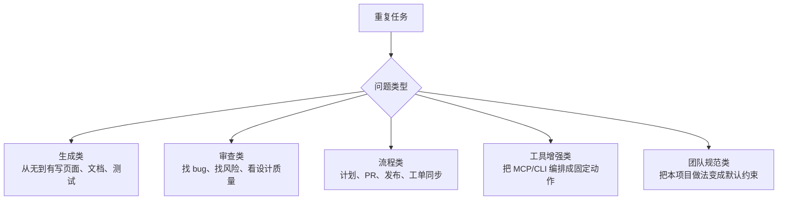

<div data-theme-toc="true"></div>

# 5.7 常见 skills 类型、来源和评估方法

不要把 skills 当作可随意安装的插件；一次安装过多会增加触发冲突和行为不确定性。

一个好 skill 的价值不在形式，而在它能不能把你已经认可的工作方法，变成 Agent 可重复执行的流程。它不是收藏项，是流程约束。

本节的判断顺序是：先找重复问题，再看是否已有稳定流程，最后才决定下载、改写或自建 skill。

## 先按问题分类

选 skill 前，先确认一个问题：想减少哪类重复手工操作或重复流程说明？



如果无法回答这个问题，先不要安装。此时更可能缺少清晰流程，而不是缺少 skill。

## 生成类 skills

生成类 skill 适合用于生成第一版。比如：

- 需要快速生成前端页面、着陆页、组件库示例。
- 需要生成 README、API 文档、迁移说明。
- 需要把设计要求转成可运行原型。

它适合快速生成初稿，但不能直接作为最终交付。建议用法是：

```text
先给产品目标、视觉方向、技术栈和约束。
再让 skill 生成第一版。
最后用审查或 polish 类型 skill 做二次审查。
```

主要风险是优先追求视觉效果而忽略可维护性。做前端时，应提前明确响应式、可访问性、主题变量和组件边界。生成后不要直接合并，至少运行一次构建，并检查首屏、移动端和关键交互。

## 审查类 skills

审查类 skill 适合作为独立检查层。它适合这些场景：

- PR 前自查。
- 安全敏感代码。
- 数据库迁移、批量更新、权限逻辑。
- UI/UX 质量检查。
- 性能或可维护性审查。

好的审查 skill 不应该输出大量笼统的“建议优化”。它必须给出证据：

- 先只读，不直接修改。
- 按严重程度排序。
- 给出文件位置、风险原因和复现方式。
- 区分确定问题、可能风险和建议优化。
- 不把“个人偏好”伪装成 bug。

优先做 `pre-review`。它不需要理解完整业务，只要能把 diff、测试结果、风险点整理成人能快速审查的摘要，就已经有价值。

## 流程类 skills

流程类 skill 管的是每次都要提醒 Agent 的固定步骤。比如：

- 从 issue 生成计划。
- 从 PRD 拆任务。
- 修 CI 失败。
- 发布前检查。
- 写 PR 描述。
- 更新工单状态。

这类 skill 通常会写清楚四件事：

- 输入：issue URL、失败日志、需求描述、PR diff。
- 步骤：读取、归纳、计划、执行、验证、总结。
- 输出：计划、变更摘要、测试结果、风险列表、后续事项。
- 停止条件：缺少权限、高风险文件、无法复现、验收标准不明。

如果你发现自己第三次复制同一段提示词，就应考虑把它收进 skill。

## 工具增强类 skills

工具增强类 skill 通常和 MCP 或 CLI 搭配。MCP 负责“能做什么”，skill 负责“按什么顺序做、何时停止”。

例子：

- 用 [GitHub MCP Server](https://github.com/github/github-mcp-server) 读取 PR 评论，再逐条处理。
- 用 [Playwright MCP](https://github.com/microsoft/playwright-mcp) 复现 UI bug，再给出修复方案。
- 用 [Sentry](https://github.com/getsentry/sentry) / [Datadog Agent](https://github.com/DataDog/datadog-agent) MCP 拉错误上下文，再定位代码。
- 用 Figma MCP 读取设计信息，再生成组件实现计划。

这里要控制权限。高权限 MCP 必须有人类确认点；对外部系统的写操作默认关闭，除非你明确授权。每次调用外部系统后，也要把关键事实沉淀到任务记录，不要只保留在一次聊天里。

## 团队规范类 skills

当团队反复出现同类问题，就不要继续依赖口头提醒。把经验写成 skill，让 Agent 每次都先按规则检查。常见类型有：

- 后端分层检查。
- SQL 风险检查。
- 前端组件规范检查。
- API 兼容性检查。
- 文档同步检查。
- 发布回滚检查。

这类 skill 不应写成“请写可验证、可维护的代码”。这句话表达正确但不可执行。它必须写团队自己的判断标准：

- 这个仓库禁止在哪些目录直接写业务逻辑。
- 哪些接口字段不能轻易改名。
- 哪些测试命令代表最低验收。
- 哪些文件属于高风险区域。
- 哪些历史问题必须在设计阶段检查。

## 从哪里找 skills

可以按以下顺序选择 skill：

1. 先从自己的重复工作中提炼小 skill。
2. 再看官方或工具作者维护的 skills。
3. 再看大型开源项目中持续更新、issue 活跃的 skills。
4. 最后才考虑和你技术栈、团队流程接近的社区 skills。

想看 Agent Skills 的标准和示例，优先看 [Agent Skills 标准文档](https://agentskills.io/)；需要查看源码、提交贡献或反馈 issue 时，再看 [agentskills/agentskills 源仓库](https://github.com/agentskills/agentskills)。

star 数只能说明“有关注度”，不能说明“适合你”。安装前先看这些：

- 最近是否维护。
- 是否有清晰 README。
- 是否说明权限和风险。
- 是否有示例任务。
- 是否能独立卸载。
- 是否只包含指令，还是还会运行脚本或访问外部服务。

## 安装前评估

第三方 skill 会影响 Agent 行为。不要只按普通文档处理，应按代码或配置变更审查。至少看：

- `SKILL.md` 的 description 是否过宽。过宽会导致误触发。
- instructions 是否会要求跳过测试、忽略错误、自动提交。
- 是否包含 scripts、assets、references。
- 是否要求 API key、网络权限、写入权限。
- 是否会把外部内容注入到上下文里。
- 是否和你的 AGENTS/CLAUDE 规则冲突。

如果仍存在风险，就先复制到临时目录，让 Agent 在一个低风险任务里试跑。不要在初始评估阶段让它处理生产发布。

安装记录可以很短，但必须落盘：

```text
Skill:
来源:
解决的问题:
触发场景:
权限和脚本:
试跑任务:
保留 / 删除理由:
```

没有记录的 skill，后面很难判断是它改善了流程，还是它改变了 Agent 行为。

## 一个最小 skill 设计模板

```markdown
---
name: repo-pre-review
description: Use when preparing a local diff for human review before opening a PR.
---

# Repo Pre Review

## When to use

Use this when the user asks to prepare, review, summarize, or sanity-check a local diff.

## Steps

1. Inspect `git diff --stat` and changed files.
2. Read only the changed areas and nearby context.
3. Identify correctness, security, test, migration, and compatibility risks.
4. Run available lightweight checks if allowed.
5. Produce a review packet with summary, risks, verification, and open questions.

## Stop conditions

- Do not edit files unless explicitly asked.
- Stop if secrets, destructive migrations, or production credentials are detected.
- Mark unrun checks clearly instead of claiming success.
```

这个模板的价值在于边界和停止条件，而不是格式本身。skill 越接近明确验收清单，结果越稳定。

## 如何判断 skill 有效

不要凭主观感受判断“它好像有用”。至少运行三次：

- 一次成功路径。
- 一次信息不足路径。
- 一次高风险路径。

然后看它有没有做到这些：

- 在正确场景触发。
- 没有在无关场景误触发。
- 输出结构稳定。
- 会主动要求证据。
- 会在高风险时停下。
- 能减少你重复输入的内容。

如果一个 skill 只是让回答变长，却没有减少返工，应删除或重写。内容长度不等于专业性。

## 推荐的初学者组合

初始阶段不要保留过多 skill。第一阶段保留四类即可：

- `bug-fix`：定位、复现、修复、验证。
- `pre-review`：合并前自查。
- `frontend-design` 或 `ui-review`：前端质量辅助。
- `task-to-plan`：把需求变成可执行步骤。

等这四类稳定运行后，再加：

- `ci-fix`。
- `security-review`。
- `docs-sync`。
- `release-check`。

团队专用 skills 和 MCP 编排 skills 放到第三阶段。先让小流程稳定运行，再考虑统一管理。

## 不要贪多

skills 过多会带来三个麻烦：

- 触发条件互相抢。
- 上下文膨胀。
- Agent 行为变得难解释。

建议节奏是：

```text
先手动跑三次 -> 稳定后写成 skill -> 观察误触发 -> 再分享给团队
```

如果你还不能用一句话说清“这个 skill 解决哪个重复问题”，那它现在不应保留。

## 删除 skill 的信号

出现下面情况，就先停用或删除：

- 经常在无关任务里触发。
- 输出比原来更长，但没有减少返工。
- 要求跳过测试、忽略错误或自动提交。
- 和项目里的 AGENTS/CLAUDE 规则冲突。
- 依赖外部服务，但没有清楚说明权限。
- 三次试跑后仍不能稳定产生同类交付物。

skill 是流程资产，也会过期。删除一个误触发的 skill，通常比继续补说明更直接。
