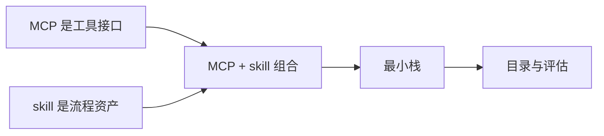

<div data-theme-toc="true"></div>

# 5. MCP 与 skills

本章讲两个最容易混淆的扩展机制：

```text
MCP:
  给 Agent 接工具和数据。

[skills](https://agentskills.io/):
  给 Agent 固化流程和经验。
```

[MCP](https://github.com/modelcontextprotocol) 和 [skills](https://agentskills.io/) 是并列机制。MCP 负责把工具接进来，skills 负责把流程固定下来；一个管事实和能力，一个管做法和交付标准，不是谁替代谁。

## 本章结构

| 子章节 | 目标 |
|---|---|
| [1-mcp-basics.md](1-mcp-basics.md) | MCP 的基本概念和安全边界 |
| [2-skills-basics.md](2-skills-basics.md) | skills 的定位和写法 |
| [3-mcp-plus-skills.md](3-mcp-plus-skills.md) | MCP 和 skills 如何组合 |
| [4-minimal-stack.md](4-minimal-stack.md) | 推荐最小扩展栈 |
| [5-skill-authoring-workshop.md](5-skill-authoring-workshop.md) | 从重复流程提炼一个 skill |
| [6-mcp-selection-catalog.md](6-mcp-selection-catalog.md) | MCP 类型目录与风险分级 |
| [7-skill-catalog-and-sources.md](7-skill-catalog-and-sources.md) | 常见 skills 类型、来源和评估方法 |

## 本章阅读方式



先接只读 MCP，再接可能写入外部状态的 MCP。先写一个能减少返工的 skill，再考虑安装一整套 skill 集。新增能力必须回答一个问题：它减少了哪类复制、猜测或漏检。

## 读完要学会什么

| 产物 | 用途 |
|---|---|
| MCP 权限清单 | 知道每个 MCP 能读什么、能写什么、凭据在哪里 |
| 最小扩展栈 | 先接只读文档、代码搜索或浏览器工具 |
| 第一个自建 skill | 把重复流程写成可触发、可停止、可检查的说明 |
| skill 评估记录 | 判断下载或自建的 skill 是否应保留 |

## 本章边界

MCP 解决工具和事实来源，skills 解决流程复用。本章不负责多 Agent 编排和长任务恢复；这些内容放在 [6. Harness Engineering](../6-harness-engineering/index.md)。
