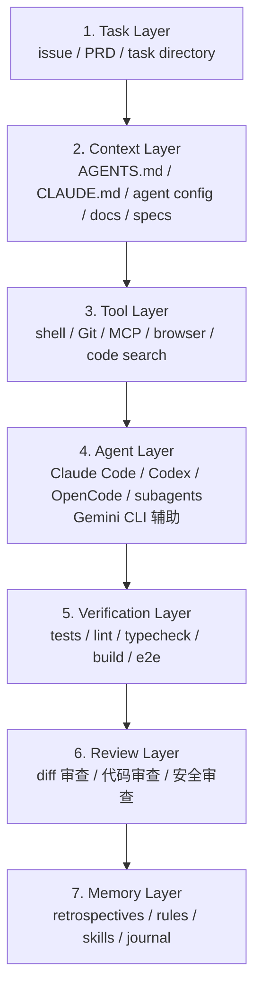
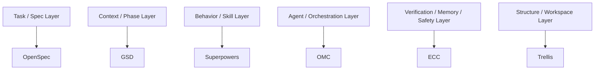

# 6.1 Harness 全景图

按层拆分 harness，可以先看七层。这张图用来排查：当前哪一层缺失，Agent 就会在哪一层反复出问题。

## 每层解决什么

| 层 | 解决的问题 | 最小落点 |
|---|---|---|
| Task | AI 到底要做什么 | issue、PRD、task 目录 |
| Context | AI 需要知道什么 | `AGENTS.md`、`CLAUDE.md`、docs、specs |
| Tool | AI 能调用什么 | shell、Git、MCP、browser、code search |
| Agent | 谁来执行 | Claude Code、Codex、OpenCode、subagents |
| Verification | 怎么证明完成 | tests、lint、typecheck、build、e2e |
| Review | 谁来判断质量 | diff 审查、代码审查、安全审查 |
| Memory | 经验如何进入下一次 | retrospectives、rules、skills、journal |

## 框架通常补哪一层

这张图用于定位，不表示排名：

同一个项目可以组合多个层，但每一层只能有一个主要事实来源。否则任务、spec、memory、verification 会互相冲突。

## 最容易缺的层

新手通常缺：

- Verification：未运行测试就接受输出。
- Memory：同样错误下一次继续发生。
- Task：需求不清楚就开始实现。
- Review（审查）：只看聊天总结，不看 diff。

稳定工作流的差异不在 prompt 更复杂，而在这些层是否有人维护。没人维护的层，迟早会退回聊天记录里。
