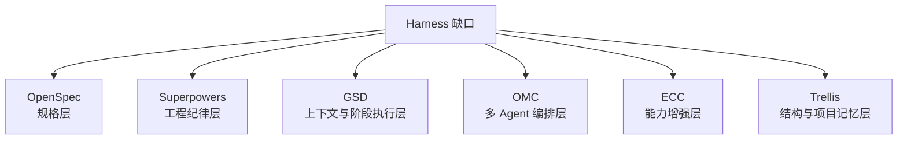
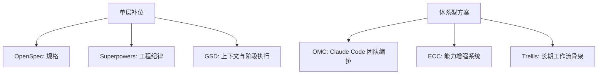

<div data-theme-toc="true"></div>

# 6.10 六条代表性 Harness 路线

[OpenSpec](https://github.com/Fission-AI/OpenSpec)、[Superpowers](https://github.com/obra/superpowers)、[GSD](https://github.com/gsd-build/get-shit-done)、[OMC](https://github.com/Yeachan-Heo/oh-my-claudecode)、[ECC](https://github.com/affaan-m/everything-claude-code)、[Trellis](https://github.com/mindfold-ai/trellis) 不适合放进同一张单一优劣榜单。它们补的是 Harness 的不同层。

如果你还没判断自己缺哪一层，先读 [8-harness-frameworks-catalog.md](8-harness-frameworks-catalog.md)。如果你已经决定组合工具，再读 [11-harness-composition-patterns.md](11-harness-composition-patterns.md)。

## 先看定位



这张图不表示采用顺序，只用于定位缺口。实际采用时，先找当前最影响任务推进的缺口，再决定是否组合。

## 总览

| 路线 | 主要补哪层 | 一句话用途 |
|---|---|---|
| OpenSpec | 规格层 | 先把需求、设计、任务说清楚，再让 Agent 开工 |
| Superpowers | 工程纪律层 | 把 TDD、debug、审查、worktree 等习惯变成默认动作 |
| GSD | 上下文与阶段执行层 | 把复杂任务拆进干净上下文，降低长会话劣化 |
| OMC | 多 Agent 编排层 | 围绕 Claude Code 做团队式多 Agent 协作 |
| ECC | 能力补全层 | 给 harness 补 skills、memory、安全、验证和学习机制 |
| Trellis | 结构与项目记忆层 | 用 specs / tasks / workspace 组织长期工作流 |

## [OpenSpec](https://github.com/Fission-AI/OpenSpec)：规格先行

OpenSpec 更接近 spec framework，而不是执行引擎。它解决的是“还没说清楚就开始执行”的问题。

适合：

- 需求边界容易漂。
- 团队需要先评审规格和设计。
- Brownfield 项目里改动需要可追溯。
- 高风险功能需要 proposal、design、tasks 先落盘。

不适合：

- 你只是改一个小 typo。
- 你期待它自动完成多 Agent 编排。
- 你没有维护规格工件的意愿。

使用原则：

```text
先对齐规格，再进入执行。
spec 是执行依据，不是事后补文档。
```

## [Superpowers](https://github.com/obra/superpowers)：工程纪律默认化

Superpowers 更像一组 composable skills，把工程师的工作习惯做成 Agent 的默认动作。

适合：

- Agent 经常不计划就写。
- Bug 修复没有复现和根因分析。
- 测试驱动、debug、审查、worktree 隔离没有形成习惯。
- 你已经有主力 Agent，但缺工程纪律。

不适合：

- 需求本身还没定义清楚。
- 团队没有统一质量标准。
- 你希望它替代任务系统或项目记忆系统。

使用原则：

```text
把“每次都要提醒”的流程做成 skill。
skill 管流程，不管事实来源。
```

## [GSD](https://github.com/gsd-build/get-shit-done)：上下文与阶段执行

GSD 关注 context rot：长会话中无关信息增多，复杂任务容易偏离原目标。它的价值在于把讨论、计划、执行、验证拆成阶段，并让每个阶段有清晰状态。

适合：

- 长任务容易上下文劣化。
- 大仓库重构需要分阶段推进。
- 复杂任务需要阶段性验证和原子提交。
- 你希望每个阶段都能被接手和回看。

不适合：

- 任务很小，不需要阶段化。
- 项目没有基本验证命令。
- 你只是想补一个 spec 入口。

使用原则：

```text
复杂任务不要依赖一个长会话支撑。
把阶段、状态、验证和提交划分清楚。
```

## [OMC](https://github.com/Yeachan-Heo/oh-my-claudecode)：多 Agent 编排

OMC 更偏 Claude Code 场景下的 team-first orchestration。它关心多个 agent 如何按团队协作方式工作。

适合：

- Claude Code 是主力工具。
- 任务可以拆成计划、执行、验证和修复。
- 你需要并行 worker、tmux、subagent 或多模型顾问。
- 你能清楚划分写入范围和合并责任。

不适合：

- 需求还很模糊。
- 文件边界高度重叠。
- 没有测试和审查来验收多个 Agent 输出。
- 你需要跨工具长期任务资产骨架，而不是 Claude Code 编排。

使用原则：

```text
并行之前先切边界。
没有验证能力，多 Agent 只会让问题并行扩大。
```

## [ECC](https://github.com/affaan-m/everything-claude-code)：能力增强与补全

ECC 更像一套 harness enhancement：补 skills、instincts、memory、安全审查、验证和持续学习。它不是最低成本起步方案，更适合已经有基础 harness 后做能力补全。

适合：

- 你已经有项目规则和任务流，但经验没有稳定沉淀。
- 你希望强化 memory、security、validation、learning。
- 你需要跨 Claude Code、Codex、Cursor、OpenCode 等工具保持一些一致行为。
- 团队准备把 AI workflow 长期工程化。

不适合：

- 初学者尚未稳定执行单 Agent 闭环。
- 项目没有稳定测试和审查标准。
- 你只是想解决单次需求跑偏。

使用原则：

```text
先有骨架，再做增强。
能力补全不是替代底层结构。
```

## [Trellis](https://github.com/mindfold-ai/trellis)：结构、任务和项目记忆

Trellis 更像长期工作流骨架。它通过 specs、tasks、workspace，把项目规范、任务状态和跨会话记忆统一到本地仓库里。

适合：

- 团队不只用一个 AI 工具。
- 任务经常跨多天、多会话、多 Agent。
- 项目规范、任务记录和工作记忆需要共享。
- 你希望把 AI 工作流写进本地仓库结构，而不是停留在个人聊天习惯里。

不适合：

- 一次性脚本或 demo。
- 不愿维护任务文件和规格文件。
- 你追求的是单次执行速度或体验，而不是长期可恢复。

使用原则：

```text
让项目围绕 specs / tasks / workspace 运转，
而不是围绕某一次个人聊天记录运转。
```

## 单层补位 vs 体系型方案



这个划分用于帮助你决定引入成本。单层补位通常更适合作为第一步；体系型方案更适合在你已经知道自己要长期维护什么时引入。

## 快速选择规则

| 当前主要问题 | 优先看 |
|---|---|
| 需求经常偏离目标 | OpenSpec |
| Agent 写法不守工程纪律 | Superpowers |
| 长任务上下文劣化 | GSD |
| 多 Agent 并行没有组织 | OMC |
| 缺 memory / security / validation / learning | ECC |
| 多工具、多任务、项目记忆混乱 | Trellis |

不要把这张表当采购清单。它的作用是帮你定位当前缺口。
