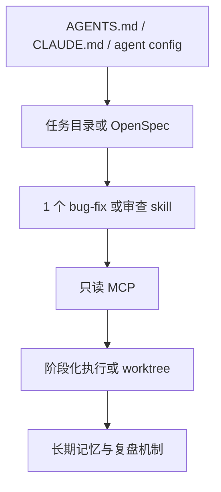

<div data-theme-toc="true"></div>

# 6.11 Harness 组合策略

Harness 组合时，每一层只补一个明确缺口。框架数量多，不代表系统更稳。

## 三步判断


每次只回答一个问题：

- 需求是否清楚？
- Agent 是否按工程纪律执行？
- 上下文是否能跨阶段保持干净？
- 多 Agent 是否真的需要并行？
- 验证、记忆、安全是否足够？
- 任务状态是否能长期恢复？

## 推荐组合

| 组合 | 适合解决 | 注意点 |
|---|---|---|
| [OpenSpec](https://github.com/Fission-AI/OpenSpec) + [Superpowers](https://github.com/obra/superpowers) | 先控制需求偏离，再控制实现越界 | spec 管“做什么”，skill 管“怎么做” |
| [OpenSpec](https://github.com/Fission-AI/OpenSpec) + [GSD](https://github.com/gsd-build/get-shit-done) | 先固定规格，再分阶段执行复杂任务 | 避免 proposal、plan、phase 文档重复 |
| [OMC](https://github.com/Yeachan-Heo/oh-my-claudecode) + [Superpowers](https://github.com/obra/superpowers) | 多 Agent 编排加工程纪律 | 必须明确写入范围和审查者角色 |
| [Trellis](https://github.com/mindfold-ai/trellis) + [OpenSpec](https://github.com/Fission-AI/OpenSpec) | 长期任务骨架加规格驱动 | 要定义哪个目录是规格事实来源 |
| [Trellis](https://github.com/mindfold-ai/trellis) + [Superpowers](https://github.com/obra/superpowers) | 任务状态落盘加流程默认化 | skill 输出要回写 task/journal |
| [Trellis](https://github.com/mindfold-ai/trellis) + [ECC](https://github.com/affaan-m/everything-claude-code) | 长期项目记忆加能力增强 | 适合进阶团队，不适合初始引入 |

## 不推荐的组合方式

| 坏写法 | 后果 |
|---|---|
| 两套 spec 系统同时当事实来源 | 需求冲突，verify（符合性检查）不知道对齐谁 |
| 多个任务目录系统并存 | handoff（交接记录）分散，恢复成本上升 |
| skills、hooks、commands 都管同一流程 | 规则冲突，Agent 不知道听谁 |
| 没有测试就启用多 Agent | 并行输出无法验收 |
| 一开始就叠加三层以上框架 | 控制面比业务还复杂 |

## 主骨架优先

如果一个项目已经进入长期维护，先选主骨架：

```text
OpenSpec 主骨架：
  适合规格驱动强、变更必须先审的团队。

Trellis 主骨架：
  适合多工具、多任务、跨会话项目记忆强的团队。

OMC 主骨架：
  适合 Claude Code 重度使用、明确需要团队式多 Agent 编排的工作流。
```

主骨架确定后，其他工具只能补层，不能替代事实来源。否则同一个需求会在多个目录里有多个版本，Agent 不知道该信哪一个。

## 轻量起步路线

个人或小团队不要一开始追求完整体系。建议路线：



这条路线的关键是：先让单 Agent 可控，再让多 Agent 并行；先确保中断后能按记录恢复，再做系统自动化。

## 组合前检查清单

- [ ] 已经确认当前要解决的具体问题，不是因为“看到他人使用某个框架就跟着使用”。
- [ ] 每个框架负责的层不同。
- [ ] 规格、任务、记忆各自只有一个事实来源。
- [ ] 验证命令能跑，且失败后有处理流程。
- [ ] 高风险写入有人工确认点。
- [ ] 新增框架不会让普通任务更难完成。

## 一句话原则

```text
轻量框架可以双层组合。
重型框架先单独稳定运行。
没有主次关系的叠加会增加技术债。
```
