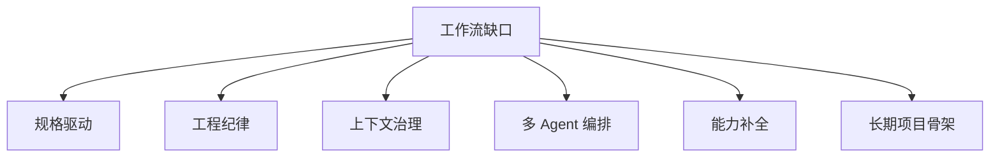

<div data-theme-toc="true"></div>

# 6.3 工作流工具的粗分类

当 `AGENTS.md` / `CLAUDE.md` 不够时，再考虑工作流工具。先做粗分类，再看具体框架；不要在初始阶段给框架排总榜。



## 粗分类与代表路线

| 缺口类型 | 代表路线 | 先解决的问题 |
|---|---|---|
| 规格驱动 | [OpenSpec](https://github.com/Fission-AI/OpenSpec) / Spec Kit / Kiro | 做什么、为什么做、验收什么 |
| 工程纪律 | [Superpowers](https://github.com/obra/superpowers) / 自定义 skills | 怎么按 TDD、debug、审查、验证流程做 |
| 上下文治理 | [GSD](https://github.com/gsd-build/get-shit-done) / 任务分阶段工具 | 长任务怎么分阶段、怎么避免上下文劣化 |
| 多 Agent 编排 | [OMC](https://github.com/Yeachan-Heo/oh-my-claudecode) / [CCG](https://github.com/fengshao1227/ccg-workflow) / worktree | 多个 Agent 如何分工、并行和回收 |
| 能力补全 | [ECC](https://github.com/affaan-m/everything-claude-code) / memory / security / eval 工具 | skills、记忆、安全、验证、学习机制如何补齐 |
| 长期项目骨架 | [Trellis](https://github.com/mindfold-ai/trellis) / 仓库内任务系统 | specs、tasks、workspace、journal 如何长期落盘 |

## [Trellis](https://github.com/mindfold-ai/trellis)

定位：

```text
多平台 AI 编码工作流规范层。
```

适合：

- 多工具并用。
- 需要任务目录和 PRD。
- 需要 specs、journal、上下文注入。
- 团队希望统一规范。

不适合：

- 一次性小任务。
- 不愿维护 specs/tasks 的团队。

## [CCG Workflow](https://github.com/fengshao1227/ccg-workflow)

定位：

```text
Claude + Codex + Gemini 三 CLI 协作。
```

适合：

- 想让 Claude 规划、Codex 做逻辑、Gemini 做前端/长上下文辅助。
- 想在中文社区现有工作流上继续扩展。
- 多模型路由和命令体系。

不适合：

- 只想用一个 Agent。
- 不愿处理多工具配置。

## [Superpowers](https://github.com/obra/superpowers)

定位：

```text
用 skills、命令和做法强制 Agent 走 TDD、计划、验证、审查。
```

适合：

- Agent 经常不计划就写。
- Agent 经常不测试就说完成。
- 想把工程纪律固化成 skills。

## Spec 工具

代表：

- Spec Kit。
- OpenSpec。
- Kiro。
- spec-workflow-mcp。

适合：

- 需求复杂。
- 需要可追溯规格。
- 高风险功能。
- 团队协作。

主要想法：


## 怎么选

| 当前缺口 | 工具 |
|---|---|
| 项目规范和任务状态混乱 | Trellis |
| 需要三模型分工 | CCG |
| Agent 跳过测试和审查 | Superpowers |
| 长任务上下文劣化 | GSD / 任务分阶段工具 |
| Claude Code 多 Agent 没有组织 | OMC / subagents / worktree |
| 缺 memory、安全、验证、学习机制 | ECC / 自定义能力补全层 |
| 需求必须规格先行 | Spec Kit / OpenSpec / Kiro |
| 只想轻量增强单 Agent | AGENTS.md / CLAUDE.md / agent config + 自定义 skill |

更完整的六条 Harness 路线见 [10-six-harness-routes.md](10-six-harness-routes.md)。如果你已经准备组合多个框架，先读 [11-harness-composition-patterns.md](11-harness-composition-patterns.md)。
