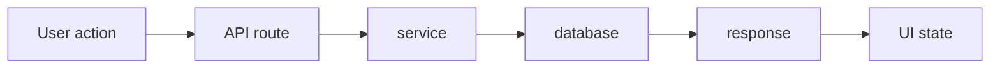

<div data-theme-toc="true"></div>

# 6.6 为一个项目搭最小 Harness

> 这一节说明如何在普通本地仓库里建立最小可用的 Agent 开发 Harness，让 `Codex`、`Claude Code` 或 `OpenCode` 每次工作都更稳定。

`Harness Engineering` 的概念较大，但起步范围可以很小。这里讲的是从普通本地仓库搭起第一版 Harness 的步骤；如果你只需要概念，回到 [2.3 Harness Engineering](../2-engineering-layers/3-harness-engineering.md)；如果你需要可复制的最终模板，直接看 [9.4 最小项目模板和执行步骤](../9-development-system/4-minimal-template.md)。

这里的 Harness 不是指某个单一产品。它指一套可重复的工作台：任务说明、项目规则、脚本命令、测试、检查、日志、回滚办法，以及每轮完成后怎么验收。

最小 harness 先解决以下 4 个问题：

```text
Agent 应该读什么？
Agent 应该怎么做？
Agent 怎么验证？
Agent 做完后怎么留下状态？
```

## 最小目录结构

```text
.
├── AGENTS.md / CLAUDE.md / opencode.json
├── docs/
│   ├── commands.md
│   └── architecture.md
└── tasks/
    └── current/
        ├── prd.md
        ├── plan.md
        └── journal.md
```

如果你同时使用 `Codex`、`Claude Code` 和 `OpenCode`，可以维护一份共享规则，再做工具适配：

```text
AGENTS.md
CLAUDE.md
opencode.json
docs/agent-common.md
```

## 第 1 步：写 Agent 入口规则

`AGENTS.md` / `CLAUDE.md` 可以直接写成下面这样。OpenCode 项目可以把同一组规则放进共享文档，并在 `opencode.json` 里约束 agent 使用：

```markdown
# Agent Rules

## Start Here

Before editing, read:
- `docs/commands.md`
- `docs/architecture.md`
- current task under `tasks/current/` if present

## Working Rules

- Start with read-only analysis for non-trivial tasks.
- Keep changes minimal and scoped.
- Do not introduce new dependencies without confirmation.
- Do not modify `.env` or secrets.
- Do not revert unrelated user changes.
- Run relevant validation before saying done.

## Done Means

- Acceptance criteria are satisfied.
- Relevant tests or checks were run.
- If checks cannot run, explain why and provide manual verification.
- Update docs if commands, architecture, public API, or conventions changed.
```

## 第 2 步：写命令文档

`docs/commands.md`：

```markdown
# Commands

## Install

`pnpm install`

## Development

`pnpm dev`

## Test

`pnpm test`

## Typecheck

`pnpm typecheck`

## Lint

`pnpm lint`

## Build

`pnpm build`

## Notes

- Use `pnpm`, not `npm`.
- If a command fails because dependencies are missing, report it instead of switching package managers.
```

这能减少 Agent 猜测命令的情况。

## 第 3 步：写架构索引

`docs/architecture.md` 可以先采用以下结构：

```markdown
# Architecture

## Purpose

[项目一句话目标]

## Main Directories

- `src/app/`: routes and pages.
- `src/components/`: UI components.
- `src/lib/`: shared logic.
- `src/server/`: server-side business logic.
- `tests/`: tests.

## Data Flow

这里放一张 Mermaid 数据流图，避免用纯文本箭头描述调用链。
```

示例：



继续补充架构规则：

```markdown
## Important Rules

- Business logic belongs in services, not route handlers.
- Shared validation schemas live in `src/lib/validation`.
- Public API changes require tests and docs updates.
```

架构文档不需要一次写全，先确保 Agent 找得到方向。

## 第 4 步：写当前任务 PRD

`tasks/current/prd.md`：

```markdown
# Current Task

## Goal

[本次任务目标]

## User Value

[为什么要做]

## Requirements

- [ ] Requirement 1
- [ ] Requirement 2

## Out of Scope

- [ ] Not doing X
- [ ] Not changing Y

## Acceptance Criteria

- [ ] Checkable criterion 1
- [ ] Checkable criterion 2

## Risks

- Risk 1
- Risk 2
```

## 第 5 步：让 Agent 生成计划

`tasks/current/plan.md` 可以让 Agent 写。

```text
请读取 AGENTS.md、docs/commands.md、docs/architecture.md 和 tasks/current/prd.md。
先不要修改代码。
请生成 tasks/current/plan.md，包含：
- 现状理解。
- 需要修改的文件。
- 实施步骤。
- 风险。
- 验证命令。
- 回滚或恢复策略。
```

计划确认后再进入实现。

## 第 6 步：维护 journal

`tasks/current/journal.md`：

```markdown
# Journal

## YYYY-MM-DD HH:mm

### Done

- Completed X.

### Validation

- Ran `pnpm test`: passed.

### Issues

- Y failed because Z.

### Next

- Continue with A.
```

长任务中，journal 是恢复上下文的关键。

## 使用方式

每次新会话开头：

```text
请按项目 harness 工作。
先读取 AGENTS.md / CLAUDE.md / opencode.json、docs/commands.md、docs/architecture.md 和 tasks/current/。
不要修改文件，先总结当前任务状态和下一步计划。
```

第一个练习用小任务，不要直接上生产功能：

```text
请先阅读 README.md、AGENTS.md 和 tasks/current/prd.md。
只改本任务需要的文件。
完成后运行 npm run verify。
如果失败，先根据错误修复一次，再重新运行。
最后汇报：改了哪些文件、验证命令结果、还有什么风险。
```

如果项目不是 Node，把 `npm run verify` 换成项目真实命令：

```text
Python: uv run ruff check . && uv run pytest
Rust: cargo fmt --check && cargo clippy -- -D warnings && cargo test
Go: go test ./... && go vet ./...
Java: mvn test 或 gradle test
```

这个练习要求 Agent 按固定顺序交付证据：读了什么、改了什么、跑了什么、还剩什么风险。

## 什么时候升级

| 重复出现的问题 | 升级 |
|---|---|
| 多任务并行混乱 | 每个任务独立目录 |
| 多 Agent 冲突 | worktree |
| 规则越来越多 | specs 分层 |
| 重复流程太多 | skills |
| 外部信息搬运重 | MCP |
| 质量不稳定 | eval / checklists / CI gates |

## 完成标准

- [ ] Agent 进入项目后知道先读哪里。
- [ ] Agent 不再猜测验证命令。
- [ ] 每个任务都有 PRD 和验收标准。
- [ ] 长任务中断后可以从 journal 恢复。
- [ ] 文档同步已写入任务完成标准。
