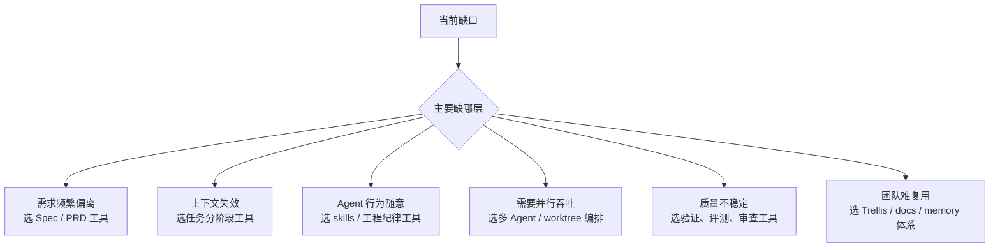
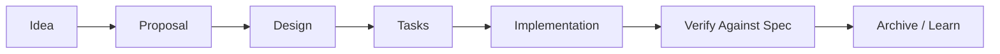

<div data-theme-toc="true"></div>

# 6.8 Harness 相关工具和框架怎么选

Harness 工具不是同一种东西。很多争论来自把“规范工具”“技能包”“多 Agent 编排”“任务系统”“评测系统”放到同一维度比较。

先判断你缺哪一层，再选工具。不要因为一个框架看起来完整，就把它全量塞进项目。

本节是工具类型目录，只回答“当前缺哪一层”。如果你想直接区分 [OpenSpec](https://github.com/Fission-AI/OpenSpec)、[Superpowers](https://github.com/obra/superpowers)、[GSD](https://github.com/gsd-build/get-shit-done)、[OMC](https://github.com/Yeachan-Heo/oh-my-claudecode)、[ECC](https://github.com/affaan-m/everything-claude-code)、[Trellis](https://github.com/mindfold-ai/trellis) 六条代表路线，读 [10-six-harness-routes.md](10-six-harness-routes.md)。如果你准备组合多个框架，读 [11-harness-composition-patterns.md](11-harness-composition-patterns.md)。

## 先看缺口



轻量项目先补影响最大的一层，不要让控制面比项目还复杂。每加一层，都要能说清它会减少哪种返工。

## Spec / PRD 工具

代表方向：

- [OpenSpec](https://github.com/Fission-AI/OpenSpec)。
- Spec Kit。
- Kiro 类规格驱动环境。
- 自建 `specs/changes/<id>/` 目录。

解决的问题：

- 需求不清楚就开工。
- 设计决策只留在聊天里。
- 任务边界反复变化。
- 开发后无法解释为什么这么改。

适合场景：

- 多文件、多模块改动。
- 后端接口、数据库、权限、支付等高风险功能。
- 团队需要评审需求和设计，而不是只审查代码。
- Brownfield 项目里有历史约定。

怎么用：



使用规则：

- spec 是执行依据，不是事后补文档。
- 第一版 spec 不要立即写代码，先让 Agent 找风险和缺口。
- verify（符合性检查）只检查实现是否符合 spec，不等于代码审查。

停止信号：

- 需求还没有负责人确认。
- 验收标准无法观察。
- spec 只复述想法，没有边界和非目标。
- 实现已经偏离 spec，但没有更新记录。

## Skills / 工程纪律工具

代表方向：

- [Superpowers](https://github.com/obra/superpowers) 类可组合 skills。
- SuperClaude 类命令/角色增强。
- 自建项目 skills。
- 前端设计、审查、debug、TDD 类 skill 包。

解决的问题：

- Agent 直接写代码，不先计划。
- Agent 不复现就修 bug。
- Agent 不跑测试就说完成。
- 每次都要重复提醒同一套流程。

适合场景：

- 个人已经形成一套稳定工作方法。
- 团队想把审查、debug、CI 修复变成固定动作。
- 想让 Agent 更像工程师，而不是只像代码生成器。

怎么用：

- 从一个重复任务开始，不要从完整框架开始。
- 写明触发场景、步骤、输出、停止条件。
- 保持 description 精确，避免误触发。
- 把测试和验收标准写进 skill，而不是只写笼统要求。

停止信号：

- 同一个 skill 经常接管不相关任务。
- skill 让 Agent 输出更多说明，但没有改变执行顺序。
- 团队还没有认可这套流程。
- 触发条件比任务本身还难解释。

## 多 Agent / worktree 编排

代表方向：

- Codex 多 Agent / worktree。
- Claude Code subagents。
- Claude Code swarms / team 类编排。
- [CCG](https://github.com/fengshao1227/ccg-workflow) 类多模型协作。
- 自己用 Git worktree + 多终端组织。

解决的问题：

- 一个 Agent 做完整任务太慢。
- 计划、实现、审查混在一起。
- 大任务需要并行探索多个方案。
- 不同模型在不同任务上强项不同。

适合场景：

- 多个独立模块可以并行。
- 你能清楚划分写入范围。
- 有足够验证手段回收结果。
- 需要审查者与实现者分离。

不适合场景：

- 任务本身还没定义清楚。
- 文件边界高度重叠。
- 没有测试和审查能力。
- 你只是想让多个 Agent 同时尝试不同结果。

最小实践：

```text
Agent A: 只读探索，输出方案和风险。
Agent B: 在 worktree-1 实现后端。
Agent C: 在 worktree-2 补测试或前端。
Agent D: 只读审查，不能改代码。
Human: 合并、取舍、最终负责。
```

停止信号：

- 写入范围无法拆开。
- 多个 Agent 都要改同一批文件。
- 没有集成负责人。
- 没有可以回收结果的测试或审查清单。

## 任务系统 / 上下文治理工具

代表方向：

- [Trellis](https://github.com/mindfold-ai/trellis)。
- [GSD](https://github.com/gsd-build/get-shit-done) 类分阶段执行。
- 自建 `tasks/<date-slug>/prd.md`。
- issue + PRD + implementation notes。

解决的问题：

- 长任务执行中途上下文劣化。
- 新会话无法接续旧任务。
- 需求、计划、验证结果散落在聊天中。
- 多工具协作没有共同状态。

适合场景：

- 任务跨多天。
- 需要多人或多个 Agent 接力。
- 希望每次工作都有可恢复的任务目录。
- 需要把项目记忆记录下来。

最小结构：

```text
tasks/
  2026-04-29-login-refactor/
    prd.md
    plan.md
    journal.md
    verification.md
    handoff.md
```

关键不在文件名，而在“每次重要状态变化都落盘”。

停止信号：

- 任务只需要一次短修改。
- 任务文件无人维护。
- journal 只记录聊天摘要，没有决策、验证和风险。
- 新会话仍然必须靠人重新口述上下文。

## MCP / 外部工具连接

代表方向：

- [GitHub MCP Server](https://github.com/github/github-mcp-server) / GitLab MCP。
- [Atlassian MCP Server](https://github.com/atlassian/atlassian-mcp-server) / Linear / [Notion MCP Server](https://github.com/makenotion/notion-mcp-server)。
- [Playwright MCP](https://github.com/microsoft/playwright-mcp) / Browser MCP。
- Figma MCP。
- [Sentry](https://github.com/getsentry/sentry) / [Datadog Agent](https://github.com/DataDog/datadog-agent) / 日志 MCP。
- 数据库只读 MCP。

解决的问题：

- 复制粘贴外部上下文太慢。
- Agent 看不到真实工单、日志、设计稿、监控。
- 需要把开发动作和外部系统连接起来。

适合场景：

- 外部系统是事实来源。
- 读取比写入更重要。
- 工具有清晰权限边界。
- 调用结果可以记录和验证。

安全默认值：

- 先接只读。
- 先接低风险。
- 不把生产写权限直接授予 Agent。
- 所有会影响外部系统的写操作都需要人工确认。

停止信号：

- 权限范围说不清。
- 外部数据源不是事实来源。
- 调用结果不能被任务记录引用。
- 写操作没有人工确认点。

## 验证 / 评测 / 可观测工具

代表方向：

- 测试、lint、typecheck、构建、E2E。
- 轻量回归样例库。
- CI 检查。
- 日志和 trace。
- AI 审查。
- 自定义 eval 脚本。

解决的问题：

- Agent 的“完成了”没有证据。
- 修一个 bug 破坏另一个路径。
- 多 Agent 输出难合并。
- prompt 或 skill 改了以后效果不可比较。

适合场景：

- 任何真实项目。
- 任何多人协作。
- 任何长期维护项目。

最小要求：

```text
每个任务至少有一种自动证据 + 一种人工证据。
自动证据: tests / lint / typecheck / build / e2e。
人工证据: diff 审查 / UI 预览 / 验收清单。
```

停止信号：

- 评测样例和真实任务无关。
- 指标只用来比较模型，不回到流程修正。
- 失败结果没有进入复盘。
- 检查命令经常失败，但团队已经习惯忽略。

## 怎么组合

不要在初始阶段追求“完整平台”。按阶段组合。

### 个人轻量组合

- `AGENTS.md`。
- `docs/architecture.md`。
- `tasks/<slug>/prd.md`。
- 1 个 bug-fix skill。
- 1 个 pre-review skill。
- Git diff + tests。

### 认真项目组合

- Spec / PRD 工具。
- Trellis 或任务目录。
- MCP 只读接 GitHub、docs、浏览器。
- skills 管理 bug、审查、CI、docs。
- worktree 做并行。
- CI 做质量闸。

### 团队组合

- 团队级 AGENTS/CLAUDE 规范。
- specs 与 ADR。
- 项目知识库。
- 受控 MCP。
- 共享 skills。
- 审查 subagent。
- 发布和回滚 checklist。
- 复盘机制。

## 选型原则

1. 先补稳定性，再补吞吐。
2. 先接只读工具，再接写操作。
3. 先把重复流程写成 skill，再引入复杂编排。
4. 先让单 Agent 可验证，再做多 Agent。
5. 先确保中断后能按记录恢复，再做长任务自动化。

Harness 的价值来自清楚的位置分工：每个工具都补一个明确缺口。

下一步不应继续横向收集工具名。先回到六条路线的分层定位，再决定是否组合：见 [10-six-harness-routes.md](10-six-harness-routes.md) 和 [11-harness-composition-patterns.md](11-harness-composition-patterns.md)。
