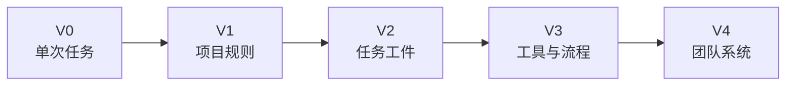
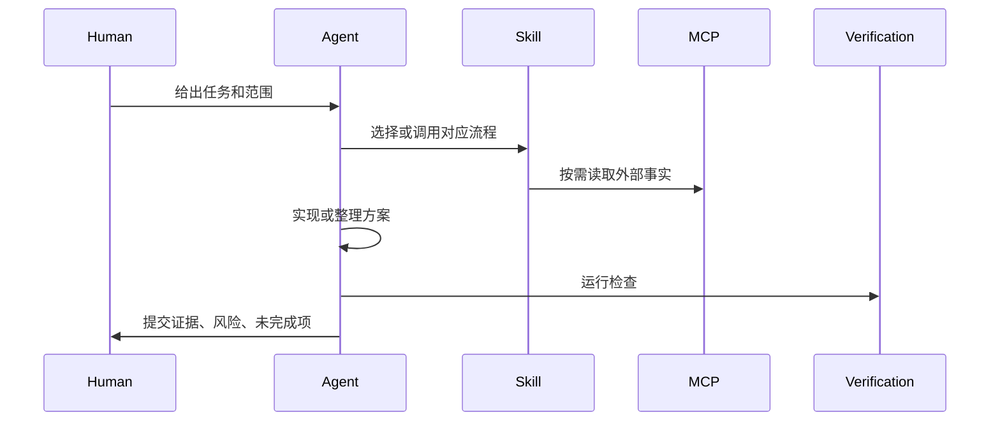
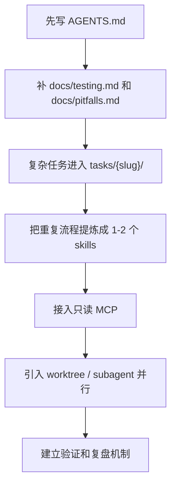

<div data-theme-toc="true"></div>

# 6.9 从轻量到生产级 Harness 的实施路线

Harness 不需要一次性完整搭建。可以分为五个阶段：能交代、规则可复用、任务可追溯、流程可控、团队可恢复。

## 阶段图



每个阶段都应该能独立产生价值。不要为了“表面工程化”而增加文件。

注意：V0 到 V4 是采用阶段递进，不是框架排名。OpenSpec、Superpowers、GSD、OMC、ECC、Trellis 的定位差异见 [10-six-harness-routes.md](10-six-harness-routes.md)，组合方式见 [11-harness-composition-patterns.md](11-harness-composition-patterns.md)。

## V0：单次任务可交代

目标：让 Agent 做完一次任务后，你能知道它做了什么、怎么验证。

需要的东西：

- 一个清楚 prompt。
- 一个文件范围。
- 一个验证命令。
- 一段最终总结。

适合：

- 小 bug。
- 单文件改动。
- 小脚本。
- 文档修正。

最小 prompt：

```text
目标：修复 <现象>。
范围：优先检查 <文件/模块>，不要改无关文件。
约束：保持现有风格，不引入新依赖。
完成标准：复现问题，修复后运行 <命令>，最后总结改动和验证结果。
```

如果 V0 无法稳定执行，不要立即增加 MCP 或多 Agent。

## V1：项目规则可复用

目标：不用每次重复告诉 Agent 项目基本规则。

新增资产：

```text
AGENTS.md
CLAUDE.md
docs/architecture.md
docs/testing.md
docs/pitfalls.md
```

`AGENTS.md` / `CLAUDE.md` 的职责是入口地图，而不是百科全书。

应该写：

- 项目怎么启动、测试、构建。
- 常见目录和模块。
- 重要约束和禁止事项。
- 任务前必须读取哪些文档。
- 高风险操作的停手条件。

不应该写：

- 大段业务细节。
- 过期的架构说明。
- 泛泛的“写可验证、可维护的代码”。
- 与项目无关的个人偏好。

## V2：任务工件可追溯

目标：让每次复杂变更都有独立记录。

新增资产：

```text
tasks/
  <date>-<slug>/
    prd.md
    plan.md
    journal.md
    verification.md
    handoff.md
```

职责：

- `prd.md`：目标、范围、验收标准。
- `plan.md`：实现步骤、文件范围、风险。
- `journal.md`：关键过程、决策、阻塞。
- `verification.md`：运行过什么检查、结果是什么。
- `handoff.md`：如果换会话，下一位 Agent 如何接手。

适合：

- 多文件功能。
- 重构。
- 需要用户确认的需求。
- 有多个实现方案的任务。

执行规则：

- 需求变化先改 PRD，再改代码。
- Agent 偏离任务时先回任务文件，不要在聊天里继续追加临时解释。
- 每次重要决策都落盘。

## V3：工具与流程可控

目标：让 Agent 不仅写代码，还能按固定流程调用工具。

新增资产：

```text
.opencode/skills/、.codex/skills/ 或 .claude/skills/
mcp.json / config.toml / settings.json
scripts/check-*.sh
scripts/guard-*.py
```

适合接入：

- 只读代码搜索。
- 浏览器自动化。
- GitHub/PR 信息。
- 文档检索。
- 日志检索。
- 轻量 eval。

暂缓接入：

- 生产数据库写权限。
- 发布权限。
- 账单和付款系统。
- 会修改外部状态的批量操作。

流程：



执行规则：

- MCP 负责事实，skill 负责流程。
- 写操作必须有确认点。
- 工具输出要写入任务记录。
- Agent 不能因为工具可用就跳过人工判断。

## V4：团队系统可恢复

目标：让团队成员和多个 Agent 都能在同一套系统里工作。

新增资产：

```text
docs/adr/
docs/domain/
docs/runbooks/
specs/
reviews/
retrospectives/
shared-skills/
```

需要明确：

- 谁可以改规则。
- 什么时候更新 AGENTS/CLAUDE。
- 哪些 skills 是团队标准。
- 哪些 MCP 是批准过的。
- 多 Agent 如何划分写入范围。
- PR 前必须有哪些证据。
- 任务失败后怎么回滚和复盘。

团队级 harness 的目标是减少口头约定，让任务、上下文、权限和验证都能被查到。

## 一条推荐采用路线



不要反向推进。先启用多 Agent、再补规则，通常会让混乱并行发生。

## 什么时候该升级

从 V0 到 V1：

- 你每次都在重复说明测试命令、目录结构、风格规则。

从 V1 到 V2：

- 任务开始跨多个文件，需求或设计需要确认。

从 V2 到 V3：

- 你反复让 Agent 做同一种流程，或者需要外部系统事实。

从 V3 到 V4：

- 多人、多 Agent、多项目开始共享这套工作流。

## 什么时候不要升级

- 项目还只是一次性脚本。
- 你没有稳定测试命令。
- 团队还没有共同质量标准。
- 你只是因为看到他人使用了某个框架。

Harness 是为交付服务的，不是为流程形式服务的。升级后如果普通任务更难完成，说明控制面过重。

## 最小执行 checklist

- [ ] 根目录有 `AGENTS.md` 或等价项目规则。
- [ ] 有一个文档说明怎么测试和构建。
- [ ] 复杂任务有任务目录。
- [ ] Agent 开始前会先只读分析。
- [ ] Agent 完成后必须给出验证证据。
- [ ] 高风险文件有停手条件。
- [ ] 至少有一个审查或 pre-review 流程。
- [ ] 复盘发现的新规则会进入文档或 skill。
