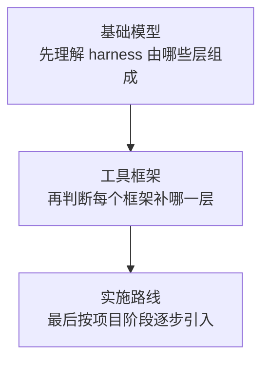

<div data-theme-toc="true"></div>

# 6. Harness Engineering：分层搭建开发系统

Harness Engineering 的目标是把 coding agent 放进一套可控、可验证、可恢复的工程系统。

如果你只需要理解概念，先读 [2.3 Harness Engineering](../2-engineering-layers/3-harness-engineering.md)。这一章负责结构、框架路线和实施顺序；执行时的清单和提示词放在 [8. 实用做法](../8-best-practices/index.md)，可复制的最终项目模板放在 [9.4 最小项目模板](../9-development-system/4-minimal-template.md)。

这一章可以按三组阅读：



并列关系要按“层”理解，递进关系要按“采用阶段”理解。不要把 [OpenSpec](https://github.com/Fission-AI/OpenSpec)、[Superpowers](https://github.com/obra/superpowers)、[GSD](https://github.com/gsd-build/get-shit-done)、[OMC](https://github.com/Yeachan-Heo/oh-my-claudecode)、[ECC](https://github.com/affaan-m/everything-claude-code)、[Trellis](https://github.com/mindfold-ai/trellis) 放进单一优劣顺序。

## 本章结构

### 基础模型

| 子章节 | 目标 |
|---|---|
| [1-harness-map.md](1-harness-map.md) | 看懂 harness 全景 |
| [2-agents-md-claude-md.md](2-agents-md-claude-md.md) | 写好 AGENTS.md / CLAUDE.md |
| [4-multi-agent-workflow.md](4-multi-agent-workflow.md) | 多 Agent 和 worktree |
| [5-validation-and-eval.md](5-validation-and-eval.md) | 验证、评测和质量闸 |

### 工具框架

| 子章节 | 目标 |
|---|---|
| [3-workflow-tools.md](3-workflow-tools.md) | 先按工具类型建立粗分类 |
| [8-harness-frameworks-catalog.md](8-harness-frameworks-catalog.md) | 按缺口选择工具和框架 |
| [10-six-harness-routes.md](10-six-harness-routes.md) | 区分 OpenSpec / Superpowers / GSD / OMC / ECC / Trellis |
| [11-harness-composition-patterns.md](11-harness-composition-patterns.md) | 按层组合，避免无序堆叠 |

### 实施路线

| 子章节 | 目标 |
|---|---|
| [6-build-minimal-harness.md](6-build-minimal-harness.md) | 为项目搭最小 Harness |
| [7-long-task-governance.md](7-long-task-governance.md) | 长任务治理、恢复和交接 |
| [9-harness-adoption-roadmap.md](9-harness-adoption-roadmap.md) | 从轻量到生产级的实施路线 |

## 先按缺口选，不按名气选

```text
缺需求对齐：先看 OpenSpec / spec 工具。
缺工程纪律：先看 Superpowers / skills。
缺上下文治理：先看 GSD / task phases。
缺并行编排：先看 OMC / subagents / worktree。
缺能力补全：先看 ECC / memory / security / validation。
缺长期骨架：先看 Trellis / specs / tasks / workspace。
```

Harness 的质量不由工具数量决定，而由边界、证据、恢复和规则沉淀决定。最小 harness 也应该说明四件事：任务从哪里来，上下文在哪里，验证怎么跑，下一轮会话如何接手。

## 读完要学会什么

| 产物 | 用途 |
|---|---|
| Harness 层级图 | 判断任务、上下文、工具、Agent、验证、审查、记忆分别在哪里 |
| Agent 入口草案 | 让 Agent 进入仓库后先读规则 |
| 长任务目录 | 把 PRD、计划、日志、验证和交接落盘 |
| 框架缺口表 | 判断 OpenSpec、Superpowers、GSD、OMC、ECC、Trellis 各补哪一层 |
| 采用路线 | 从最小 harness 逐步加任务治理、MCP、skills、worktree 和复盘 |

## 本章边界

本章讲系统结构和采用顺序，不替你写每次任务的具体提示词。执行时回到 [8. 实用做法](../8-best-practices/index.md)，最终模板看 [9.4 最小项目模板](../9-development-system/4-minimal-template.md)。
