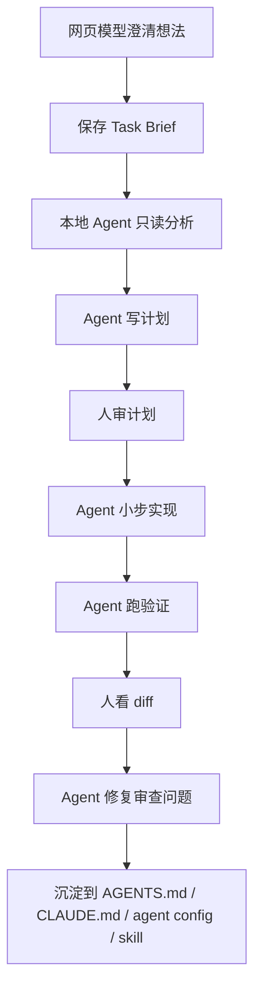

# 8.1 个人开发者工作流

个人开发者最容易犯的错是：工具持续增加，但任务状态缺乏管理。

## 推荐最小流程

## 每次任务前

任务开始前先准备这五件事：

- 目标。
- 不做什么。
- 相关路径。
- 验收标准。
- 验证命令。

缺任何一个，都先补，不要开工。

## 每次任务中

任务进行中关注这些边界：

- 单次只做一个目标。
- 先计划再实现。
- 大任务拆成小任务。
- 改动范围不清楚就暂停。
- 测试失败先定位再修。

## 每次任务后

任务收尾时，不要只结束会话；应把可复用经验记录下来：

- 哪条规则应该沉淀？
- 哪个流程适合做成 skill？
- 哪个测试应该补？
- 哪个文档应该更新？

个人效率来自可复用的习惯，不来自每次临时处理。一次任务结束后，至少留下验证结果或一条明确的“不需要沉淀”的判断。
