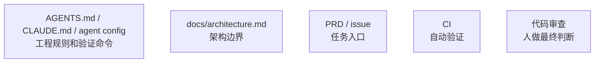
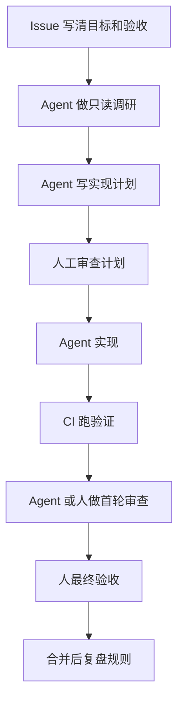

# 8.2 团队工作流

团队使用 AI 的重点不在每个人都擅长 prompt，而在团队共用同一套上下文和质量标准。

## 团队最小规范

## 团队任务流程

## 团队不要做什么

这些做法短期看起来灵活，长期会增加 AI 产出的合并成本：

- 每个人各写一套全局规则。
- 不维护规范文件。
- 没有 CI 时让 AI 做大范围改动。
- 把 AI 审查当最终验收。
- 让多个 Agent 同时改同一主要模块。
- 把失败经验只留在聊天记录里。

## 团队指标

可以追踪这些信号：

- AI 任务一次通过率。
- 审查发现的高危问题数。
- CI 修复轮次。
- 重复 bug 数量。
- 需求澄清轮次。
- 从 issue 到 PR 的周期。

指标用于改进工作流。指标异常时，优先检查任务定义、上下文入口和验证闸门，再考虑是否换模型。
