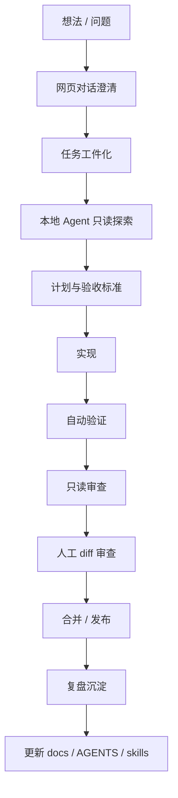
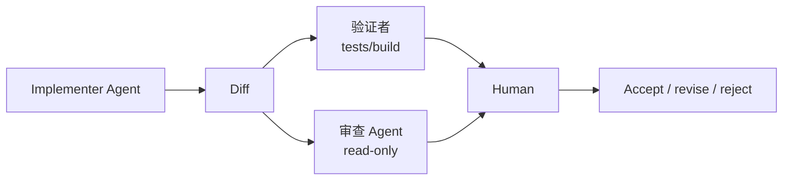

<div data-theme-toc="true"></div>

# 8.7 端到端操作手册：从想法到交付

这一节把前面的内容收成一条默认路线。日常开发时照这条线走，只有任务足够特殊时才偏离。

这里不再解释 Prompt / Context / Harness 的概念，也不展开框架选型。概念看 [2. Prompt / Context / Harness 三层工程方法](../2-engineering-layers/index.md)，harness 执行看 [6. Harness Engineering](../6-harness-engineering/index.md)，最终项目模板看 [9.4 最小项目模板](../9-development-system/4-minimal-template.md)。

## 总流程



基本原则很简单：越靠近生产代码，越要从聊天记录转向证据。

## 1. 网页对话只做前置澄清

网页 GPT / Claude / Gemini 适合：

- 解释概念。
- 比较方案。
- 整理需求。
- 生成第一版 PRD。
- 查漏补缺。
- 做第二意见。

不适合：

- 直接改真实仓库。
- 判断未读取过的项目约定。
- 代替你确认测试已通过。
- 在没有 diff 的情况下做最终审查。

建议流程：

```text
先在网页端把想法变成任务卡。
再把任务卡交给本地 Agent。
不要把网页端生成的代码直接粘进项目。
```

## 2. 每个任务先有完成标准

任务开始前先写清楚：

- 目标是什么。
- 不做什么。
- 涉及哪些模块。
- 可能有哪些风险。
- 如何验证。
- 什么时候必须停手问人。

如果你只写“帮我优化一下”，Agent 会自行补全标准。补全出来的标准不一定是你要的标准。

## 3. 先让 Agent 读，不要先让它改

复杂任务第一轮先只读探索：

```text
请先只读分析，不要修改文件。
输出：
1. 相关文件和调用链。
2. 现有实现模式。
3. 可能方案。
4. 风险和需要确认的问题。
5. 建议验证命令。
```

这一步能暴露 Agent 是否真的理解项目，而不是直接套用通用模板。

## 4. Prompt 用四段式

```text
Goal:
  我想达成什么结果，以及为什么。

Context:
  相关文件、需求、错误日志、设计约束、已有约定。

Constraints:
  不要做什么、必须遵守什么、权限和范围在哪里。

Done When:
  通过哪些检查，交付哪些证据。
```

这比长篇叙事更稳，也更适合 Claude Code / Codex / OpenCode。

## 5. Context 用分层文件，而不是堆进聊天

可以这样分层：

- 根目录规则：`AGENTS.md` / `CLAUDE.md` / `GEMINI.md`。
- 项目知识：`docs/architecture.md`、`docs/domain.md`、`docs/testing.md`。
- 当前任务：`tasks/<slug>/prd.md`、`plan.md`、`journal.md`。
- 复盘沉淀：`docs/pitfalls.md`、`skills/`、`retrospectives/`。

分工原则：

- 高频规则放入口文件。
- 长知识放 docs。
- 临时上下文放 task。
- 重复流程放 skill。

## 6. MCP 先只读，skills 先小而准

MCP 默认顺序：

1. 文档检索。
2. 代码搜索。
3. 浏览器/Playwright。
4. GitHub/issue/PR 读取。
5. 日志/监控读取。
6. 外部系统写入。

第 6 类要谨慎。初学者先不要把生产写权限交给 Agent。

skills 默认顺序：

1. `bug-fix`。
2. `pre-review`。
3. `task-to-plan`。
4. `frontend-review`。
5. `ci-fix`。

不要让 skills 变成无序集合。一个 skill 如果一个月没有减少返工，就删除或重写。

## 7. 实现和审查要分离

不要让同一个 Agent 同时承担实现和最终审查职责。写代码的人容易替自己的实现找理由，Agent 也一样。

建议流程：



最小做法：

- 实现 Agent 可以改代码。
- 审查 Agent 只读。
- 人类最终看 diff。

## 8. 多 Agent 前先划清写入范围

多 Agent 适合：

- A 做后端，B 做前端。
- A 修 bug，B 补测试。
- A 探索方案，B 实现推荐方案。
- A 实现，B 只读审查。

不适合：

- 两个 Agent 同时改同一批文件。
- 需求还不清楚就并行。
- 没有 worktree 或分支隔离。
- 没有最终合并人。

分工提示：

```text
你负责 <模块/目录>。
不要修改 <其他模块/目录>。
如果发现需要跨边界修改，先停止并报告。
完成后输出变更摘要、验证结果、未解决风险。
```

## 9. 每次完成都要有证据包

完成摘要至少包含：

- 改了什么。
- 为什么这样改。
- 运行了哪些检查。
- 检查结果是什么。
- 没有运行什么，原因是什么。
- 剩余风险。
- 建议人工审查的重点。

只有“已完成”的回复不要直接接受。没有证据，就按未完成处理。

## 10. 失败时不要继续堆 prompt

Agent 偏离目标时，先做四件事：

1. 停止继续修改。
2. 查看 git diff。
3. 回到任务目标和验收标准。
4. 决定是修正、回滚部分改动，还是新开会话。

典型停止信号：

- Agent 第三次修同一个错误仍失败。
- Agent 开始修改无关文件。
- Agent 无法解释当前 diff。
- Agent 为了通过测试而删除测试或绕过校验。
- 上下文里出现互相矛盾的要求。

## 11. 复盘要进入系统

每次任务结束后问：

- 哪条规则应该写进 AGENTS/CLAUDE？
- 哪个问题应该写进 docs/pitfalls？
- 哪个重复流程应该写成 skill？
- 哪个检查应该自动化？
- 哪个 MCP 能减少复制粘贴？
- 哪个上下文过期了？

复盘如果只停留在聊天里，下次大概率仍会重复同类问题。

## 12. 一周节奏

个人可以按这个节奏维护系统：

- 每天：任务结束后补验证记录和交接摘要。
- 每两三天：整理重复 prompt，判断是否写成 skill。
- 每周：清理过期 docs，更新 AGENTS/CLAUDE。
- 每周：回看失败任务，补测试或规则。
- 每月：检查 MCP 和 skills 权限，删除不用的扩展。

## 收束原则

```text
让 AI 多做执行。
让文档承载上下文。
让工具提供事实。
让测试提供证据。
让审查保持独立。
让人类保留判断。
```

做到这里，Vibe Coding 才从“会用 AI 写代码”变成“能用 AI 完成开发任务”。差别不在口号，而在证据、边界和恢复能力。
