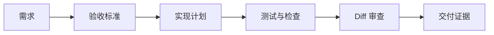

<div data-theme-toc="true"></div>

# 9.1 可验证：让完成标准落到证据

Agent 最危险的输出不是错误代码。更麻烦的是“看起来已经完成”的错误代码。可验证系统只解决一件事：任何完成声明都必须提供证据。

## 验证不是最后一步

验证要从任务定义阶段开始，而不是收尾时才补。



如果验收标准在最后才补，Agent 很容易按自行理解完成任务。

任务开始时就写验证计划，可以把很多返工挡在实现前面。验证计划不需要复杂，但要说明跑什么、看什么、无法运行时怎么替代。

## 证据分四类

### 1. 自动化证据

包括：

- 单元测试。
- 集成测试。
- E2E。
- lint。
- typecheck。
- 构建。
- smoke test。

要求 Agent 输出具体命令和结果，而不是只说“测试通过”。

可以要求它按这个格式交代：

```text
Verification:
- `npm test`: passed
- `npm run typecheck`: passed
- `npm run build`: failed, reason: existing unrelated error in <file>
- Manual UI check: not run, reason: no browser environment
```

### 2. 结构证据

包括：

- `git diff --stat`。
- 变更文件列表。
- 关键函数或模块说明。
- 新增/删除依赖。
- 数据库迁移或配置变更。

结构证据回答“到底改了哪里”。

### 3. 行为证据

包括：

- bug 复现步骤。
- 修复后同样步骤的结果。
- API 请求/响应样例。
- UI 操作路径。
- 日志变化。
- 性能或资源变化。

行为证据回答“用户看到的行为是否改变正确”。

### 4. 人工审查证据

包括：

- diff 审查结论。
- 风险点确认。
- 产品验收。
- 安全审查。
- 视觉或交互检查。

人工审查根据证据做最终判断。

## 验收标准怎么写

坏标准：

```text
优化登录体验。
```

好标准：

```text
- 未登录访问 `/settings` 时跳转登录页。
- 登录成功后回到原始目标页。
- token 过期时清理本地状态并展示提示。
- 新增或更新覆盖上述路径的测试。
- 不修改现有 OAuth 回调路径。
```

可用的标准通常有三个特征：

- 可观察。
- 可测试。
- 有边界。

## 让 Agent 自己补验证计划

每次实现前可以要求：

```text
在写代码前，请先给出验证计划：
1. 哪些路径需要测试。
2. 哪些现有测试应该运行。
3. 是否需要新增测试。
4. 哪些检查可能耗时或需要外部服务。
5. 如果不能运行某项检查，应该如何替代验证。
```

如果 Agent 无法给出验证计划，说明它还没理解任务。

## 人工审查的最低标准

人工审查至少看：

- 是否满足验收标准。
- diff 是否只包含相关改动。
- 是否存在无关格式化。
- 是否绕过错误而不是修复错误。
- 是否引入新依赖。
- 是否破坏兼容性。
- 是否补了必要测试。
- 是否更新文档或配置说明。

## 高风险任务的额外验证

遇到这些任务，不要只运行一条 happy path：

- 认证与权限。
- 支付、账单、订单。
- 数据库迁移。
- 批量更新和删除。
- 加密、密钥、凭证。
- 发布、部署、回滚。
- 对外 API。

额外要求也要同步明确：

- 设计阶段列风险。
- 实现阶段保持小步提交。
- 审查阶段使用只读审查者。
- 验证阶段保留命令和输出摘要。
- 发布前准备回滚方案。

## 可验证系统的完成定义

一个任务要算完成，需要同时满足：

- 代码实现完成。
- 验收标准逐条满足。
- 自动检查有结果。
- diff 已审。
- 风险已说明。
- 未完成项已列出。
- 复盘项已进入 docs、AGENTS 或 skills。

缺少任何一项，都只能称为“实现暂告一段落”，不能称为完成。

## 证据存放位置

证据要放在后续会话能找到的位置：

- 小任务：放在最终回复和 commit / PR 描述里。
- 多步骤任务：放在 `tasks/<slug>/verification.md`。
- 团队任务：同步到 issue、PR 或项目管理系统。
- 长期规则：沉淀到 `AGENTS.md`、`CLAUDE.md`、`docs/` 或 skill。

不要只把证据留在聊天里。仓库才是系统记录。
