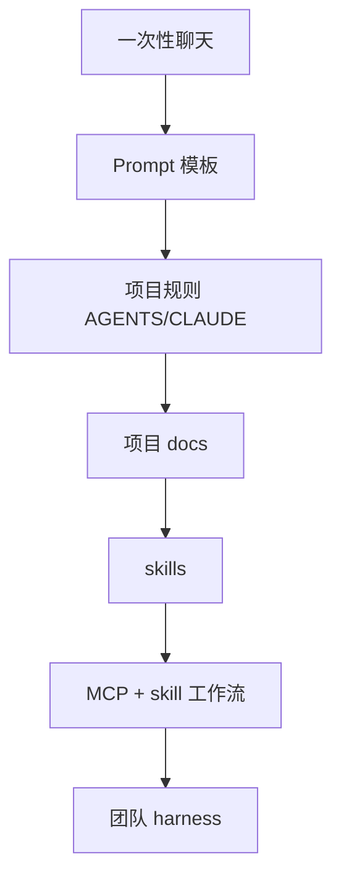
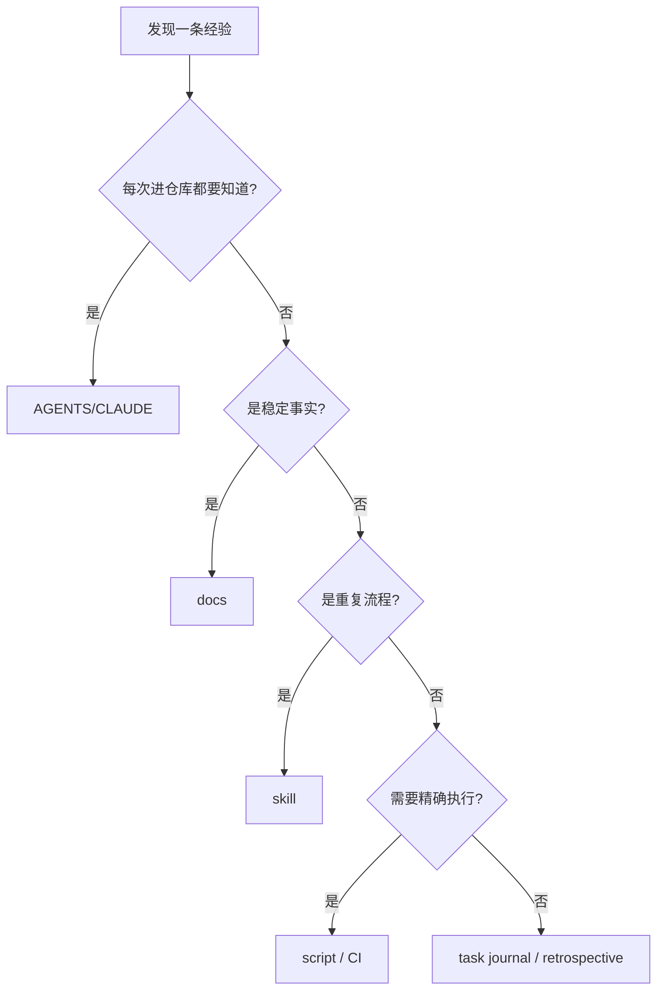

<div data-theme-toc="true"></div>

# 9.2 可复用：把经验写成资产

可复用系统要解决的是记忆不可靠的问题：这次遇到的问题，下次不依赖人工记忆；这次跑通的流程，下次不靠复制粘贴。

## 复用层级



越往下，维护成本越高，复用范围也越大。不要把所有内容都写成 skill，skill 不应该承担无关内容收纳。

## 什么应该进入 AGENTS.md

这些适合放：

- 项目启动、测试、构建命令。
- 目录地图。
- 必读文档入口。
- 工程约束。
- 高风险停手条件。
- PR 前检查要求。

这些不要放进去：

- 大段业务背景。
- 详细接口文档。
- 大量历史讨论。
- 长 prompt 模板。
- 过期 TODO。

判断标准是：Agent 每次进入仓库都该知道的信息，才放入口规则。

## 什么应该进入 docs

docs 适合承载这些内容：

- 架构说明。
- 领域规则。
- 隐性契约。
- API 约定。
- 数据模型。
- 测试策略。
- 发布流程。
- 常见问题。

docs 承载事实，不控制 Agent 行为。控制行为放 AGENTS/CLAUDE 或 skills。

## 什么应该写成 skill

满足这些条件时，再考虑写成 skill：

- 重复出现三次以上。
- 步骤稳定。
- 输出格式稳定。
- 有明确停止条件。
- 能减少人工提醒。

例子：

- “修 bug 前先复现、再定位、再修复、再验证”。
- “PR 前整理 diff、风险、测试结果”。
- “CI 失败时先读失败 job，再定位到具体测试或构建步骤”。
- “前端页面交付前检查响应式、可访问性、空状态、错误状态”。

不适合写成 skill：

- 还在探索中的流程。
- 一次性偏好。
- 只适用于某个临时任务的说明。
- 无法判断是否成功的审美要求。

## 什么应该自动化成脚本

当一段流程需要精确、可重复、可失败时，脚本比 prompt 更可靠。

这些事情适合脚本化：

- 运行一组检查。
- 生成覆盖率或报告。
- 检查敏感文件。
- 校验文档链接。
- 收集日志。
- 格式化输出。

分工原则：

```text
判断交给人和测试。
重复操作交给脚本。
流程编排交给 skill。
事实读取交给 MCP。
```

## 复盘如何进入系统

任务结束后，把复盘分类记录，不要集中在一个文件里：

- 新的项目规则 -> `AGENTS.md` / `CLAUDE.md`。
- 新的业务事实 -> `docs/domain.md`。
- 新的架构约束 -> `docs/architecture.md`。
- 新的历史问题 -> `docs/pitfalls.md`。
- 重复流程 -> `skills/<name>/SKILL.md`。
- 新检查 -> `scripts/check-*.sh` 或 CI。
- 新风险 -> 审查检查清单。

如果你不知道放哪里，先写进 `docs/pitfalls.md`，下次再整理。

## 保持可复用资产不过期

每周检查这些资产：

- AGENTS/CLAUDE 是否超过必要长度。
- docs 是否有过时命令。
- skills 是否误触发。
- MCP 是否仍然需要。
- 检查命令是否还能运行。
- 旧任务里的复盘是否已经沉淀到规则或文档。

过期规则比没有规则更危险，因为 Agent 会继续遵守错误信息。

## 一个复用决策树



这张图可以直接作为复盘时的判断依据。放错位置的经验会变成噪声，放对位置才会减少下次解释成本。
