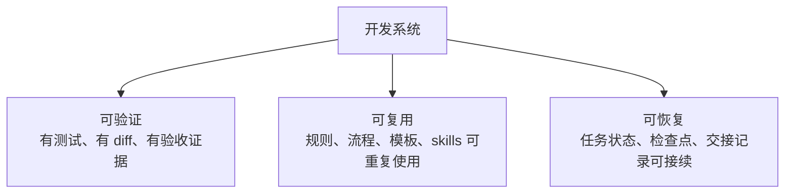
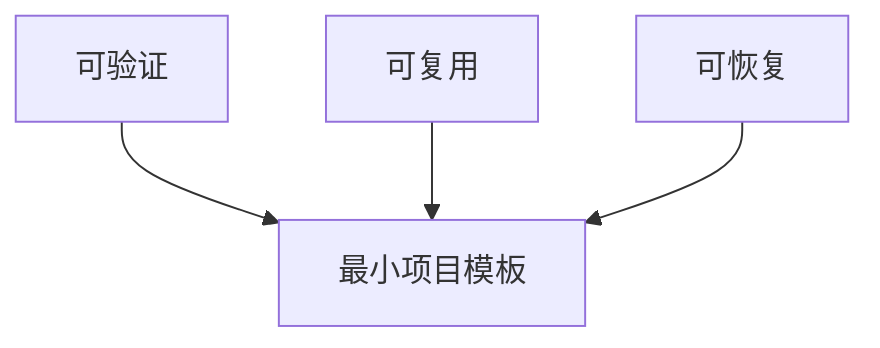

# 9. 可验证、可复用、可恢复的开发系统

前面的章节分别讲了网页对话、prompt、context、本地 Agent、MCP、skills 和 harness。第 9 章只收束到一个目标：

> 建立一套可验证、可复用、可恢复的开发系统，让稳定结果能够重复出现。

第 9 章把 [2](../2-engineering-layers/index.md) 的概念、[6](../6-harness-engineering/index.md) 的 harness 执行和 [8](../8-best-practices/index.md) 的执行规则，整理成项目里可以长期维护的系统。

## 本章结构

| 子章节 | 目标 |
|---|---|
| [1-verifiable-system.md](1-verifiable-system.md) | 把“完成了”变成证据 |
| [2-reusable-system.md](2-reusable-system.md) | 把一次经验变成下次默认能力 |
| [3-recoverable-system.md](3-recoverable-system.md) | 长任务跑偏、中断、换会话后能接回来 |
| [4-minimal-template.md](4-minimal-template.md) | 给一个项目搭最小系统 |

## 三个关键词

少了这三件事，Vibe Coding 很容易停在“看起来能用”。满足这些条件，才接近“能交付”。

## 怎么读

前三节讲并列目标，最后一节给执行模板：

第 9 章的检查标准很简单：换一个新会话、新 Agent 或新同事，他能不能从仓库里的文件继续推进，而不是回到聊天记录里考古。

## 读完要学会什么

| 产物 | 用途 |
|---|---|
| 验证证据格式 | 每次完成都能说明跑了什么、结果是什么 |
| 可复用资产分类 | 判断经验应进入 AGENTS、docs、skills、脚本还是复盘 |
| 恢复记录 | 任务中断后能从检查点接续 |
| 最小项目模板 | 把规则、任务、验证和 skill 放进仓库结构 |

## 本章边界

本章负责收束，不重新讲每个工具怎么安装。工具细节回到第 3 到第 5 章；harness 采用路线回到第 6 章。
