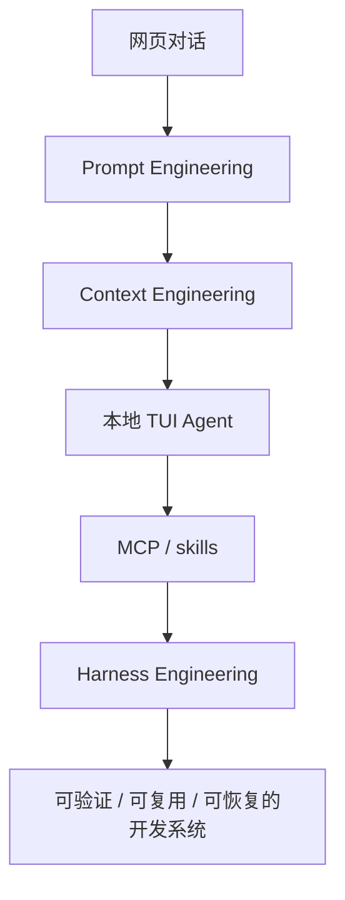

# Vibe Coding 实战手册

> 面向刚接触 Vibe Coding、还没形成完整方法的人。
> 会编程、会 Linux / 终端 / Git 会更快；暂时不会也可以读。读完后，你应该知道哪些基础要补、为什么补，以及怎样把 [Claude Code](https://github.com/anthropics/claude-code)、[Codex](https://github.com/openai/codex)、[OpenCode](https://github.com/anomalyco/opencode)、[MCP](https://github.com/modelcontextprotocol)、[skills](https://agentskills.io/) 和 Harness Engineering 放进真实仓库，用证据判断任务是否完成。

- 在线文档：[https://vibecoding.joytion.cn](https://vibecoding.joytion.cn)
- 仓库同步发布：[GitHub](https://github.com/FidStyle/Vibe-Coding-Practical-Handbook) / [Gitee](https://gitee.com/joytion/Vibe-Coding-Practical-Handbook)
- Friend link: [LINUX DO](https://linux.do)

---

## 这本手册解决什么

很多人第一次接触 Vibe Coding，是从 ChatGPT、Claude、Gemini、Cursor、Trae 或 Windsurf 写代码片段开始。常见阻碍通常不在“模型会不会写”，而在下面这些地方：

- AI 不知道项目结构，只能靠你复制粘贴。
- prompt 看起来清楚，但一改多文件就开始偏。
- 每次都要重复告诉 AI 测试命令、目录约定、代码风格。
- 网页对话能给建议，但不能自己读本地仓库、跑测试、看 diff。
- MCP、[skills](https://agentskills.io/)、AGENTS.md、CLAUDE.md、[Trellis](https://github.com/mindfold-ai/trellis)、[CCG](https://github.com/fengshao1227/ccg-workflow) 都听过，却不知道该补哪一层。
- 长任务做到一半上下文超出窗口，重新开会话又要从头解释。

这本手册不把工具排成总榜。它沿着一条线讲：怎样把一次聊天，变成一套可验证、可复用、可恢复的开发系统。

---

## 全书结构

先读 0 到 2 章，确认自己卡在任务表达、项目上下文，还是执行系统。再用 3 到 5 章跑通本地 Agent 闭环。第 6 章再谈 harness，因为没有任务、上下文和验证习惯时，过早搭复杂框架只会制造新噪音。

全书按五段读：

| 段落 | 章节 | 读完应得到什么 |
|---|---|---|
| 起点 | 0-1 | 读者定位、网页对话边界、任务交接卡 |
| 方法层 | 2 | Prompt、Context、Harness 的升级判断 |
| 执行层 | 3-5 | 本地 Agent 闭环、工具选型、MCP 与 skills |
| 系统层 | 6 | Harness 分层、框架路线、长任务治理 |
| 交付层 | 7-9 | 练习路径、执行清单、项目模板 |

不要把不同定位的工具放进同一张榜。[Claude Code](https://github.com/anthropics/claude-code) / [Codex](https://github.com/openai/codex) / [OpenCode](https://github.com/anomalyco/opencode) 是并列的本地 Agent；`网页对话 -> Prompt -> Context -> Harness` 是能力升级路径；[OpenSpec](https://github.com/Fission-AI/OpenSpec) / [Superpowers](https://github.com/obra/superpowers) / [GSD](https://github.com/gsd-build/get-shit-done) / [OMC](https://github.com/Yeachan-Heo/oh-my-claudecode) / [ECC](https://github.com/affaan-m/everything-claude-code) / [Trellis](https://github.com/mindfold-ai/trellis) 补的是 Harness 的不同层。

工具进入手册时，必须说明它补的是需求对齐、上下文治理、执行纪律、并行协作、验证，还是长期记忆。不能说明位置的工具，只会增加选择成本。

## 三种读法

| 你现在的状态 | 读法 | 停止点 |
|---|---|---|
| 还停在网页聊天 | 先读 0、1、2，再用 3.7 跑第一次本地任务 | 能写出任务交接卡，并让本地 Agent 交付一个小 diff |
| 已经会用本地 Agent | 读 3、4、5、8，补齐 loop、选型、MCP、skills 和审查清单 | 每次任务都有计划、验证记录和 diff 审查 |
| 要做长任务或团队协作 | 读 6、7、9，再回到 8 拿执行模板 | 仓库里有任务目录、规则文件、验证记录和交接摘要 |

阅读时区分两种关系：递进章节按编号读，后面的内容依赖前面的能力；并列工具按任务缺口选，不强行排第一第二。

---

## 模块目录

README 只维护模块入口，子章节目录由各章 `index.md` 负责。这样可以避免同一份目录在多处重复维护。

| 模块 | 入口 | 单一职责 |
|---|---|---|
| 0. 起步与定位 | [0-start-here/index.md](0-start-here/index.md) | 确认读者位置、基本定义、学习路线和环境准备 |
| 1. 网页对话 | [1-web-chat/index.md](1-web-chat/index.md) | 把网页聊天压成可交接的任务说明 |
| 2. 三层工程方法 | [2-engineering-layers/index.md](2-engineering-layers/index.md) | 区分 prompt、context、harness 的职责和升级信号 |
| 3. 本地 Agent | [3-local-agents/index.md](3-local-agents/index.md) | 跑通 Claude Code / Codex / OpenCode 的共通执行闭环 |
| 4. 工具选型 | [4-tool-selection/index.md](4-tool-selection/index.md) | 按任务形态选择编辑器 Agent、本地 Agent 或辅助工具 |
| 5. MCP 与 skills | [5-mcp-skills/index.md](5-mcp-skills/index.md) | 区分工具接口和流程资产，并建立最小扩展栈 |
| 6. Harness Engineering | [6-harness-engineering/index.md](6-harness-engineering/index.md) | 设计任务、上下文、工具、验证、恢复和记忆层 |
| 7. 实战路径 | [7-practice-paths/index.md](7-practice-paths/index.md) | 用具体项目练完整 loop |
| 8. 实用做法 | [8-best-practices/index.md](8-best-practices/index.md) | 提供任务执行、检查、提示词和审查标准 |
| 9. 开发系统 | [9-development-system/index.md](9-development-system/index.md) | 把规则、模板、验证和交接收束成项目系统 |
| 99. 公开资料 | [99-references/index.md](99-references/index.md) | 提供官方文档和延伸阅读入口 |

---

## 开源协议与贡献

这个仓库是文档型项目。除特别说明外，正文、图示、示例和模板按 [CC BY 4.0](LICENSE) 发布。转载或引用时，请保留标题、仓库链接和许可证说明；第三方项目名称、商标和外部链接仍归各自权利人。

想修内容、补链接或补真实实践，请先看 [CONTRIBUTING.md](CONTRIBUTING.md)。协作讨论遵守 [CODE_OF_CONDUCT.md](CODE_OF_CONDUCT.md)；敏感信息、危险链接或示例命令风险按 [SECURITY.md](SECURITY.md) 处理；普通问题和支持边界见 [SUPPORT.md](SUPPORT.md)。
